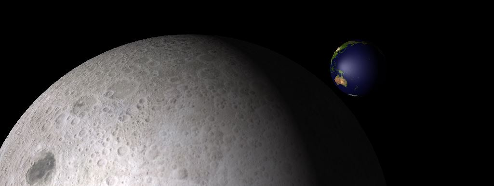
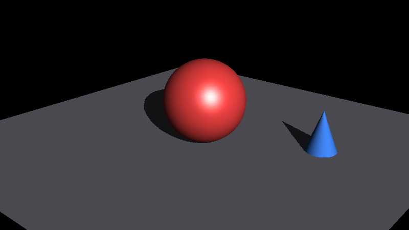
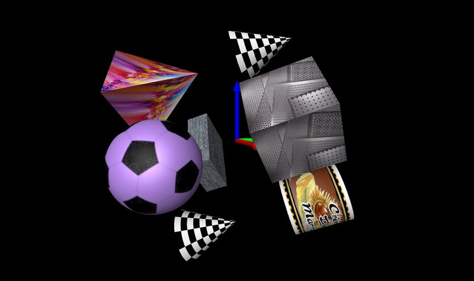
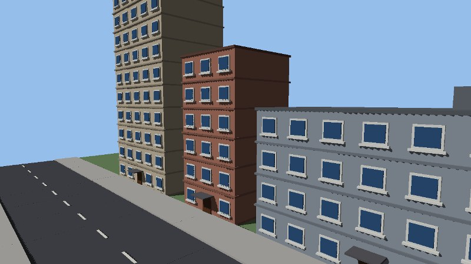
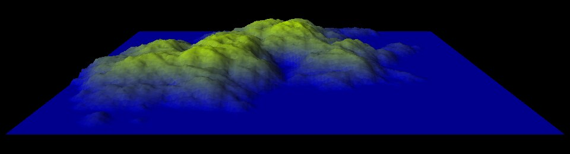
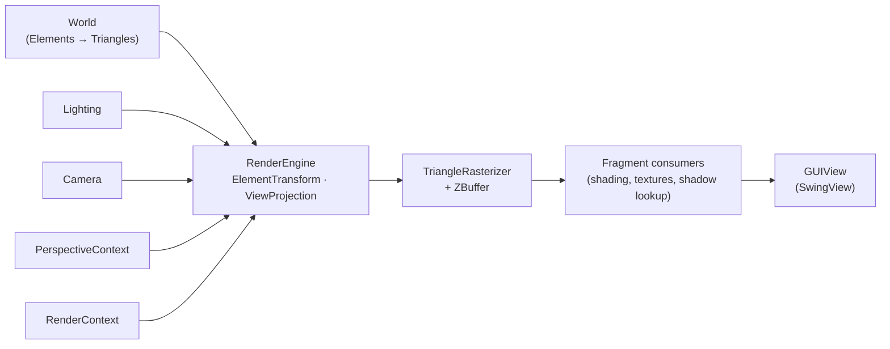

# Aventura

**A lightweight software 3D rendering engine, 100% pure Java: no GPU, no native code, no third-party library.**


Aventura lets you build a 3D scene through a plain Java API (shapes, textures, lights, shadows, camera), then rasterizes it on the CPU and hands you the pixels: in a Swing window, or straight into a `BufferedImage` you can save, stream or post-process. Because nothing depends on graphics hardware or OpenGL drivers, it runs anywhere a JVM runs, headless servers included.

<p align="center">
  
</p>

## Highlights

- **Pure Java, zero runtime dependency.** Only the JDK is needed (`java.desktop` for Swing and image loading).
- **Complete software pipeline.** Model, world and camera transforms, frustum or orthographic projection, triangle rasterization with a Z-buffer and perspective-correct interpolation.
- **Lighting and shadows.** Ambient, directional, point and spot lights (a spot has an aimable cone with a soft or sharp edge), specular highlights, and shadow mapping for directional lights (see [Lights and shadows](#lights-and-shadows)).
- **Textures.** Any image format supported by `ImageIO` (JPEG, PNG, GIF...), with per-face textures on boxes and pyramids and control over mapping direction and orientation.
- **Ready-made shapes.** Box, cube, sphere, cone, cone frustum, cylinder, disc, pyramid, torus and height-field grids (`Trellis`), plus your own geometry from triangles and meshes.
- **Hierarchical scene graph.** Elements can contain sub-elements; translations, rotations and scalings compose down the tree.
- **A math library you can reuse.** `Vector2/3/4`, `Matrix2/3/4`, `Quaternion` (with `slerp`), a Gauss-Jordan solver and geometry helpers, all unit-tested.
- **Several rendering modes on the same scene.** Wireframe, flat, plain and smooth (per-pixel) shading, with or without textures and shadows, plus debug overlays (axes, normals, light vectors).
- **Display-agnostic.** The engine renders to an abstract `GUIView`; `SwingView` is provided and can be used on-screen or off-screen.

## Gallery

<p align="center">
  
  
</p>
<p align="center">
  
  
</p>
<p align="center">
  
</p>

*Left to right, top to bottom: the "Hello, Aventura" example below (shadows and specular highlight), the `AventuraDemo` textured shapes, two frames of the `UrbanScape` helicopter flight (street level, then an overview showing the shadows of the buildings), and the `FractalLandscape_MouseMoving` procedural terrain.*

## Quick start

### Requirements

- JDK 21 or later
- [Apache Maven](https://maven.apache.org/) 3.9 or later
- A display to run the interactive demos (rendering to an image works headless)

### Build

```bash
git clone https://github.com/obarry/Aventura.git
cd Aventura
mvn clean package
```

This compiles the engine, runs the unit tests and produces `target/aventura-0.0.1-SNAPSHOT.jar`.

### Run a demo

Textures are loaded from `resources/texture/` with paths relative to the working directory, so **run the demos from the project root**.

```bash
# Default demo (Earth and Moon)
mvn test-compile exec:java

# Any other demo or visual test program
mvn test-compile exec:java -Dexec.mainClass=com.aventura.demo.AventuraDemo
mvn test-compile exec:java -Dexec.mainClass=com.aventura.demo.FractalLandscape_MouseMoving
mvn test-compile exec:java -Dexec.mainClass=com.aventura.demo.UrbanScape
mvn test-compile exec:java -Dexec.mainClass=com.aventura.test.TestSphereTexture

# Or straight from the jar built above (Earth and Moon)
java -jar target/aventura-0.0.1-SNAPSHOT.jar
java -cp target/aventura-0.0.1-SNAPSHOT.jar com.aventura.demo.AventuraDemo
```

### Import in an IDE

Eclipse, IntelliJ IDEA and VS Code all open the project as an existing Maven project (`pom.xml` at the root). Sources are in `src/main/java`, tests in `src/test/java`.

## Hello, Aventura

The following program builds a small scene, renders it **off-screen** with shadows and writes a PNG (no window, no texture files needed). It produces the first image of the gallery above.

```java
import java.awt.Color;
import java.io.File;

import javax.imageio.ImageIO;

import com.aventura.context.PerspectiveContext;
import com.aventura.context.RenderContext;
import com.aventura.engine.RenderEngine;
import com.aventura.math.transform.Translation;
import com.aventura.math.vector.Vector3;
import com.aventura.math.vector.Vector4;
import com.aventura.model.camera.Camera;
import com.aventura.model.perspective.PerspectiveType;
import com.aventura.model.light.AmbientLight;
import com.aventura.model.light.DirectionalLight;
import com.aventura.model.light.Lighting;
import com.aventura.model.world.World;
import com.aventura.model.world.shape.Cone;
import com.aventura.model.world.shape.Sphere;
import com.aventura.model.world.shape.Trellis;
import com.aventura.view.SwingView;

public class HelloAventura {

	public static void main(String[] args) throws Exception {

		// 1. The world: a floor, a sphere and a cone
		World world = new World();
		world.setBackgroundColor(Color.BLACK);

		Trellis floor = new Trellis(8, 8, 16, 16);
		floor.setColor(new Color(120, 120, 130));
		world.addElement(floor);

		Sphere ball = new Sphere(0.8f, 32);
		ball.setColor(new Color(220, 60, 60));
		ball.setSpecularExp(8);
		ball.setSpecularColor(new Color(180, 180, 180));
		ball.setTransformation(new Translation(new Vector4(0, 0, 0.8f, 0)));
		world.addElement(ball);

		Cone cone = new Cone(1.6f, 0.6f, 32);
		cone.setColor(new Color(60, 120, 220));
		cone.setTransformation(new Translation(new Vector4(2, 1, 0, 0)));
		world.addElement(cone);

		world.build();

		// 2. Light: one directional light (casts shadows) + a bit of ambient light
		Lighting lighting = new Lighting(new DirectionalLight(new Vector3(-1, 0.6f, -0.6f), 1.0f), new AmbientLight(0.15f), true);

		// 3. Camera: eye position, point of interest, "up" vector
		Camera camera = new Camera(new Vector4(6, -7, 4, 1), new Vector4(0, 0, 0.5f, 1), Vector4.zAxis());

		// 4. Display geometry: 0.8 x 0.45 view plane at distance 1, 1000 pixels per unit => 800x450 image
		PerspectiveContext perspective = new PerspectiveContext(0.8f, 0.45f, 1, 100, PerspectiveType.FRUSTUM, 1000);
		SwingView view = new SwingView(perspective); // off-screen: no window needed

		// 5. Render (smooth shading + shadows) and save
		RenderEngine engine = new RenderEngine(world, lighting, camera, RenderContext.RENDER_STANDARD_INTERPOLATE_SHADOWS, perspective);
		engine.setView(view);
		engine.render();

		ImageIO.write(view.getImageView(), "png", new File("hello.png"));
	}
}
```

Compile and run it against the classes built by Maven (use `;` instead of `:` on Windows):

```bash
javac -cp target/classes HelloAventura.java
java -Djava.awt.headless=true -cp target/classes:. HelloAventura
```

To show the result in a window instead, create the `SwingView` with a Swing component (`new SwingView(perspective, frame)`) and draw `view.getImageView()` in its `paintComponent()`, as `EarthAndMoon` does. To use textures, pass a `Texture` to the shape constructor, e.g. `new Sphere(1f, 48, new Texture("resources/texture/texture_moon_2048x1024.jpg"))`.

In the demos and in this example, the **Z axis points up** (it is used as the camera's "up" vector).

## Lights and shadows

A `Lighting` system gathers the lights of a scene. Every light has a color and an intensity factor.

| Light | Model | Shadows |
| --- | --- | --- |
| `AmbientLight` | Uniform light, without direction | Not applicable |
| `DirectionalLight` | Parallel rays, like the sun. Built from the direction in which the light **propagates** (from the light towards the scene) | Yes: one orthographic shadow map per light |
| `PointLight` | Omnidirectional source at a position; the intensity decreases linearly to zero at its maximum distance | Not yet |
| `SpotLight` | A point light aimed along a direction and limited to a cone: full intensity up to the inner half-angle, smooth fade down to zero at the outer half-angle (a sharp edge if both angles are equal) | Not yet |

A spot light is created from its position, the direction it points to (again the direction of propagation), its maximum distance and its two angles (in radians), and can be re-aimed or reshaped between two renderings:

```java
Lighting lighting = new Lighting(new AmbientLight(0.05f));

Vector4 position = new Vector4(-4, -4, 4, 1);
Vector3 direction = new Vector3(position, new Vector4(-1.5f, 0, 0.3f, 1)); // from the spot towards its target
SpotLight spot = new SpotLight(position, direction, 14, (float) Math.toRadians(30), (float) Math.toRadians(10)); // max distance, outer and inner angles
lighting.addSpotLight(spot);

spot.setLightVector(newDirection);      // re-aim it...
spot.setAngles(outerAngle, innerAngle); // ...and open or close the cone
```

<p align="center">
  
</p>

*Two spot lights (`TestLightingSpot1`): a white one with a soft edge aimed at the sphere and a warm one with a sharp edge aimed at the cube, over a dim ambient light.*

Shadow maps are only computed when shadowing is enabled in the `RenderContext`. For now only directional lights cast shadows: in a scene rendered with shadows, point and spot lights keep lighting everything they reach, without disturbing the shadows of the directional lights.

The resolution of a light's shadow map can be set per light. The size is the number of pixels of the **longest** side of the map; the other side follows the proportions of the area the light covers, so an elongated scene gets a rectangular map with no wasted pixels:

```java
DirectionalLight sun = new DirectionalLight(new Vector3(-1, 0.6f, -0.6f), 1.0f);
sun.setShadowMapSize(2048);  // sharper shadows (default: 1000)
sun.resetShadowMapSize();    // back to the default of this type of light
int size = sun.getShadowMapSize(); // size in use (set or default)
```

The default size depends on the type of light: `getDefaultShadowMapSize()` returns it, and each light class documents its own. It is `ShadowingLight.DEFAULT_SHADOW_MAP_SIZE` (1000 pixels) for directional lights.

## How it works

### The scene and the engine

A `RenderEngine` renders one `World` seen through one `Camera`, lit by one `Lighting` system. Two context objects carry every parameter, so the same scene can be rendered cheaply or richly just by swapping contexts:

- `PerspectiveContext`: how the world is projected on screen (frustum or orthographic, view plane size, near and far distances, pixels per unit);
- `RenderContext`: how it is rasterized (wireframe, flat, plain or smooth shading; textures; shadows; back-face culling; debug overlays).



For each frame, every element's vertices are moved through its transformation chain into camera space and then projected. Triangles that are visible are rasterized pixel by pixel: attributes (position, normal, texture coordinates) are interpolated with perspective correction, depth-tested against the Z-buffer, and each surviving fragment is passed to a consumer that computes its color from the material, texture and lights. Shadow maps are produced with the same rasterizer, using a depth-only consumer from the light's point of view.

### Packages

| Package | Role |
| --- | --- |
| `com.aventura.math.vector` | `Vector2/3/4`, `Matrix2/3/4`, `Quaternion` (with `slerp`), Gauss-Jordan solver, geometry helpers |
| `com.aventura.math.transform` | `Translation`, `Rotation` (from axis/angle or quaternion), `Scaling`, composable `Transformation` |
| `com.aventura.math.projection` | Frustum and orthographic projection matrices |
| `com.aventura.model.world` | `World`, hierarchical `Element`, `Triangle`, `Vertex` |
| `com.aventura.model.world.shape` | Built-in shapes: `Box`, `Cube`, `Sphere`, `Cone`, `ClosedCone`, `ConeFrustum`, `Cylinder`, `ClosedCylinder`, `Disc`, `Pyramid`, `Torus`, `Trellis` |
| `com.aventura.model.world.triangle` | Triangle meshes used to generate shapes (`FanMesh`, `FullMesh`, `CircularMesh`, `RectangleMesh`) |
| `com.aventura.model.camera` | `Camera` and its look-at matrix |
| `com.aventura.model.light` | `AmbientLight`, `DirectionalLight`, `PointLight`, `SpotLight`, and the `Lighting` system that gathers them |
| `com.aventura.model.material`, `com.aventura.model.texture` | Solid and textured materials, image textures |
| `com.aventura.context` | `RenderContext` and `PerspectiveContext` |
| `com.aventura.engine` | `RenderEngine`, `TriangleRasterizer`, `ZBuffer`, fragment consumers |
| `com.aventura.view` | `GUIView` (abstract display) and `SwingView` |
| `com.aventura.demo` | Demo applications |

### Rendering options

| Option (`RenderContext`) | Setter | Values |
| --- | --- | --- |
| Rendering type | `setRenderingType(RenderingType)` | `LINE` (wireframe), `PLAIN` (one color per triangle), `FLAT` (faceted), `INTERPOLATE` (smooth, per-pixel, default) |
| Textures | `setTextureProcessing(boolean)` | disabled by default |
| Shadows | `setShadowing(boolean)` | disabled by default |
| Back-face culling | `setBackFaceCulling(boolean)` | enabled by default (applies to closed elements) |
| Wireframe overlay | `setRenderingLines(boolean)` | disabled by default |
| Debug overlays | `setDisplayLandmark(boolean)` (axes), `setDisplayNormals(boolean)`, `setDisplayLight(boolean)` | disabled by default |

Common combinations are available as presets such as `RenderContext.RENDER_STANDARD_INTERPOLATE`, `RENDER_STANDARD_INTERPOLATE_SHADOWS` or `RENDER_STANDARD_PLAIN`. Presets are immutable: copy one, then chain the setters to customize it:

```java
RenderContext rContext = new RenderContext(RenderContext.RENDER_STANDARD_INTERPOLATE)
        .setTextureProcessing(true)
        .setShadowing(true);
```

The projection type of a `PerspectiveContext` is given by the `PerspectiveType` enum (`FRUSTUM` or `ORTHOGRAPHIC`).

### Building your own geometry

A shape is a set of triangles. To add a new one, extend `GenerativeElement` and implement `generateVertices()` and `generateTriangles()` (the compiler will remind you if you forget); `build()` and `rebuild()` take care of the rest, including normals. Or skip subclassing and feed `Element.addVertex()` / `Element.addTriangle()` directly. `Trellis` shows how to drive a grid from a height array (see `FractalLandscape_MouseMoving`).

## Demos

All demos live in `com.aventura.demo`.

| Demo | What it shows | Interaction |
| --- | --- | --- |
| `EarthAndMoon` | Two textured spheres, a directional light and specular highlights (the picture at the top of this page) | None: renders a still frame |
| `AventuraDemo` | Textured cone, cylinder, sphere, cube, box, trellis and pyramid, spinning in 3D, with the coordinate axes displayed | None: animated |
| `FractalLandscape_MouseMoving` | A procedural fractal terrain built on a `Trellis` | Drag the mouse to rotate, mouse wheel to zoom; `Run` menu: regenerate, toggle texture; `Rendering` menu: lines, plain, shading, shadows |
| `MovingCamera` | The same scene as `AventuraDemo`, with a keyboard-driven camera (smooth rotation using quaternion `slerp`) | Numeric keys: `8`/`2` look up/down, `4`/`6` look left/right, `5` move forward, `0` move back |
| `UrbanScape` | Three apartment buildings along a street, each one a three-level tree of `Element`s (building > floors > windows), lit by a mid-height sun with shadows, no texture | None: the camera flies three laps around the scene like a helicopter (off-center, tilted orbit, always looking at the middle building) |

The `src/test/java/com/aventura/test` folder holds about seventy additional visual test programs (textured shapes, meshes, lighting, shadow maps, rasterizer experiments...). Each has a `main()` and can be launched with `-Dexec.mainClass=com.aventura.test.<Name>` as shown above. The lighting ones are meant to be checked by eye: `TestLighting1` and `TestLighting2` (point lights), `TestLightingSpot1` (soft and sharp spot cones), `TestLightingSpot2` (a moving spot with a changing cone) and `TestLightingMixedShadows` (every kind of light with shadows enabled, to spot regressions in the shadows).

## Tests

```bash
mvn test
```

The unit tests (JUnit 4, about 330 of them) cover the math library (vectors, matrices, quaternions, translations, rotations, scalings, geometry tools, bounding boxes), the Z-buffer, elements, the lighting model (point and spot light attenuation and cone), the perspective bounds, a smoke render of every light type with and without shadows, and the pure logic of the interactive demos. They run without a display. A few placeholder tests that were never written are marked `@Ignore` so they show up as skipped rather than failing.

## Use Aventura in your own project

Install it in your local Maven repository:

```bash
mvn install
```

then declare it as a dependency:

```xml
<dependency>
  <groupId>com.aventura</groupId>
  <artifactId>aventura</artifactId>
  <version>0.0.1-SNAPSHOT</version>
</dependency>
```

## Project layout

```
Aventura/
├── pom.xml
├── src/
│   ├── main/java/com/aventura/   engine, math, model, view, demo
│   └── test/java/com/aventura/   JUnit tests + visual test programs (com.aventura.test)
├── resources/
│   ├── texture/                  sample textures used by the demos
│   └── doc/                      design notes (LightsAndShadowsDesign.pptx) and images
└── Aventura_moon_and_earth.jpg
```

## Current scope and limitations

- Aventura is a CPU rasterizer: it is built for clarity, portability and experimentation, not to compete with GPU performance on large scenes.
- `SwingView` is the only display implementation so far. `GUIView` is the extension point for other backends.
- A `Lighting` system holds at most one ambient light, plus any number of directional, point and spot lights.
- Only directional lights cast shadows so far. Point and spot lights light the scene but have no shadow map yet: a spot light is planned to use one perspective shadow map, a point light six (one per face of a cube).
- Lights are not drawn: a point light, a spot light or the sun is invisible even when it is in the field of view (no halo or lens effect yet).
- Texture files are loaded from file paths (relative to the working directory or absolute), not from the classpath.

## License

Aventura is released under the [MIT License](LICENSE.md). The license covers the source code; the sample images in `resources/texture` are provided to run the demos and come from various sources.

## Author

Created by [Olivier Barry](https://github.com/obarry), 2014-2026.
