# Aventura — Design Overview

> A synthesis of how Aventura is built, for contributors and curious readers.
> For installation and usage, see the [README](../README.md).

| | |
|---|---|
| **What** | A software 3D rendering engine: scene API → CPU rasterizer → pixels |
| **Language** | Java 21, JDK only (`java.desktop`), no native code, no GPU |
| **Size** | ~20 k lines in `src/main`, ~97 test classes, ~336 JUnit tests |
| **License** | MIT |
| **Status** | `0.0.1-SNAPSHOT` — stable core, lighting & shadows actively evolving |

## Contents

1. [Design goals](#1-design-goals)
2. [Architecture at a glance](#2-architecture-at-a-glance)
3. [Domain model](#3-domain-model)
4. [The rendering pipeline](#4-the-rendering-pipeline)
5. [Rasterization and fragments](#5-rasterization-and-fragments)
6. [Lighting model](#6-lighting-model)
7. [Shadow mapping](#7-shadow-mapping)
8. [Configuration: the two contexts](#8-configuration-the-two-contexts)
9. [Extension points](#9-extension-points)
10. [Quality and testing](#10-quality-and-testing)
11. [History, limitations and roadmap](#11-history-limitations-and-roadmap)
12. [Contributor conventions](#12-contributor-conventions)

---

## 1. Design goals

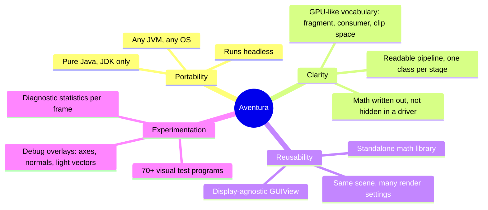
```mermaid
mindmap
  root((Aventura))
    Portability
      Pure Java, JDK only
      Runs headless
      Any JVM, any OS
    Clarity
      Readable pipeline, one class per stage
      Math written out, not hidden in a driver
      GPU-like vocabulary: fragment, consumer, clip space
    Reusability
      Standalone math library
      Display-agnostic GUIView
      Same scene, many render settings
    Experimentation
      70+ visual test programs
      Debug overlays: axes, normals, light vectors
      Diagnostic statistics per frame
```

Aventura favours **clarity and portability over raw speed**. Every stage a GPU would hide
(transform, clipping test, rasterization, depth test, shading, shadow lookup) is plain Java code
that you can read, step through in a debugger and change.

---

## 2. Architecture at a glance

The code is organised in four layers. Dependencies flow downwards only: the model never knows
about the engine, and the engine only talks to the display through the abstract `GUIView`.

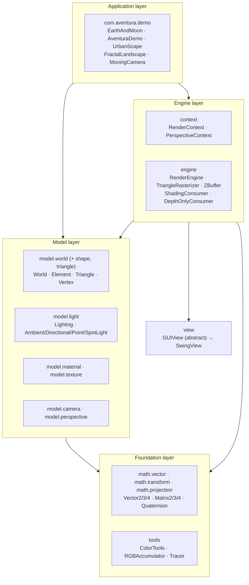
```mermaid
flowchart TB
    subgraph APP["Application layer"]
        DEMO["com.aventura.demo<br/>EarthAndMoon · AventuraDemo · UrbanScape<br/>FractalLandscape · MovingCamera"]
    end
    subgraph ENGINE["Engine layer"]
        CTX["context<br/>RenderContext · PerspectiveContext"]
        ENG["engine<br/>RenderEngine · TriangleRasterizer · ZBuffer<br/>ShadingConsumer · DepthOnlyConsumer"]
    end
    subgraph MODEL["Model layer"]
        WORLD["model.world (+ shape, triangle)<br/>World · Element · Triangle · Vertex"]
        LIGHT["model.light<br/>Lighting · Ambient/Directional/Point/SpotLight"]
        MAT["model.material · model.texture"]
        CAM["model.camera · model.perspective"]
    end
    subgraph FOUND["Foundation layer"]
        MATH["math.vector · math.transform · math.projection<br/>Vector2/3/4 · Matrix2/3/4 · Quaternion"]
        TOOLS["tools<br/>ColorTools · RGBAccumulator · Tracer"]
    end
    VIEW["view<br/>GUIView (abstract) → SwingView"]

    APP --> ENGINE
    APP --> MODEL
    ENGINE --> MODEL
    ENGINE --> VIEW
    MODEL --> FOUND
    ENGINE --> FOUND
```

### Where the code lives

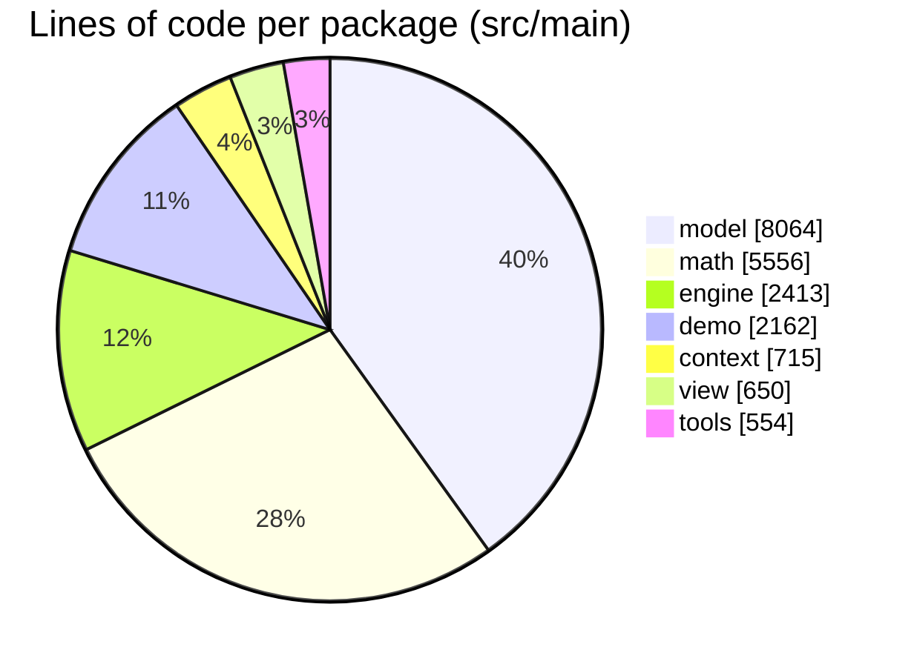
```mermaid
pie showData
    title Lines of code per package (src/main)
    "model" : 8064
    "math" : 5556
    "engine" : 2413
    "demo" : 2162
    "context" : 715
    "view" : 650
    "tools" : 554
```

| Package | Responsibility |
|---|---|
| `math.vector` | `Vector2/3/4`, `Matrix2/3/4`, `Quaternion` (+ `slerp`), Gauss-Jordan solver, geometry tools |
| `math.transform` | `Translation`, `Rotation`, `Scaling`, composable `Transformation` |
| `math.projection` | Frustum and orthographic projection matrices |
| `model.world` | `World`, hierarchical `Element`, `Triangle`, `Vertex`; built-in shapes and meshes |
| `model.light` | Light types and the `Lighting` system that gathers them |
| `model.material`, `model.texture` | `SolidMaterial`, `TexturedMaterial`, image `Texture` |
| `model.camera`, `model.perspective` | `Camera` / `LookAt`, `FrustumPerspective`, `OrthographicPerspective` |
| `context` | `RenderContext` (how to rasterize) and `PerspectiveContext` (how to project) |
| `engine` | The pipeline itself |
| `view` | `GUIView` abstraction and `SwingView` implementation |

---

## 3. Domain model

A scene is **one `World`** (a tree of `Element`s), seen by **one `Camera`**, lit by **one
`Lighting`** system. A `RenderEngine` ties the four together.

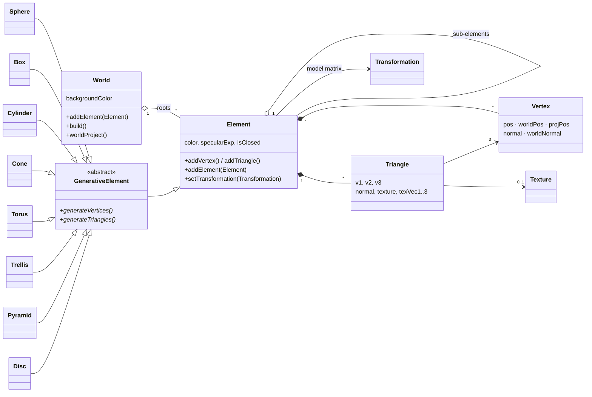
```mermaid
classDiagram
    direction LR
    class World {
      +addElement(Element)
      +build()
      +worldProject()
      backgroundColor
    }
    class Element {
      +addVertex() / addTriangle()
      +addElement(Element)
      +setTransformation(Transformation)
      color, specularExp, isClosed
    }
    class GenerativeElement {
      <<abstract>>
      +generateVertices()*
      +generateTriangles()*
    }
    class Triangle {
      v1, v2, v3
      normal, texture, texVec1..3
    }
    class Vertex {
      pos · worldPos · projPos
      normal · worldNormal
    }
    class Transformation
    class Texture
    World "1" o-- "*" Element : roots
    Element "1" o-- "*" Element : sub-elements
    Element "1" *-- "*" Triangle
    Element "1" *-- "*" Vertex
    Triangle --> "3" Vertex
    Triangle --> "0..1" Texture
    Element --> Transformation : model matrix
    GenerativeElement --|> Element
    Sphere --|> GenerativeElement
    Box --|> GenerativeElement
    Cylinder --|> GenerativeElement
    Cone --|> GenerativeElement
    Torus --|> GenerativeElement
    Trellis --|> GenerativeElement
    Pyramid --|> GenerativeElement
    Disc --|> GenerativeElement
```

### The scene graph

Elements nest. Each one carries a **model matrix** (scale → rotate → translate) relative to its
parent, and the world position of a vertex is the product of the matrices down its branch:

```
worldPos = M(L0) · M(L1) · … · M(Ln) · localPos        with  M = T · R · S
```

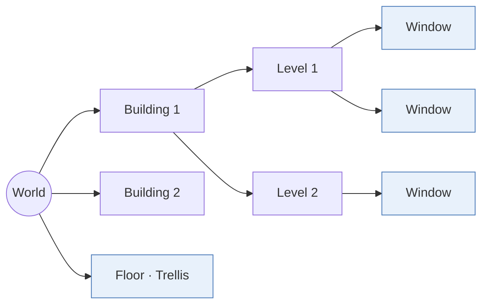
```mermaid
flowchart LR
    W((World)) --> B1[Building 1]
    W --> B2[Building 2]
    W --> F[Floor · Trellis]
    B1 --> L1[Level 1]
    B1 --> L2[Level 2]
    L1 --> W1[Window]
    L1 --> W2[Window]
    L2 --> W3[Window]
    classDef leaf fill:#e8f1fb,stroke:#4a7ab8;
    class W1,W2,W3,F leaf;
```

*Example taken from the `UrbanScape` demo: building → floors → windows, three levels deep.*

**Colour resolution** follows the same tree, lowest level wins: `Triangle` colour ›
`Element` colour › parent `Element` colour › `World` colour.

### Lights

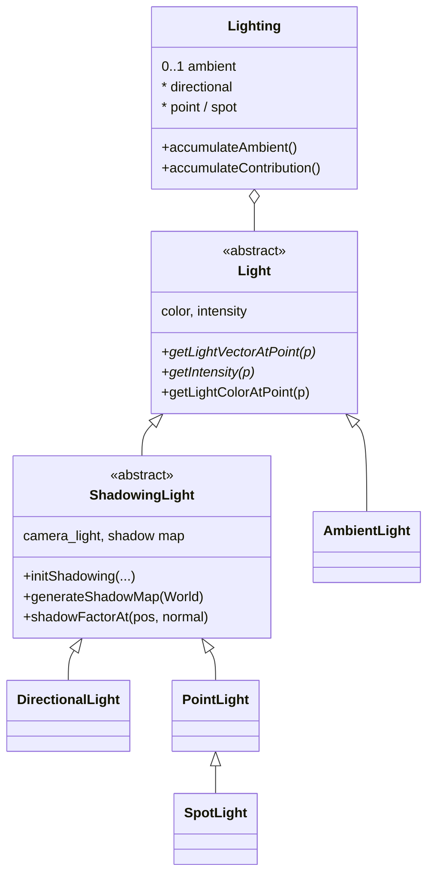
```mermaid
classDiagram
    direction TB
    class Light {
      <<abstract>>
      color, intensity
      +getLightVectorAtPoint(p)*
      +getIntensity(p)*
      +getLightColorAtPoint(p)
    }
    class ShadowingLight {
      <<abstract>>
      camera_light, shadow map
      +initShadowing(...)
      +generateShadowMap(World)
      +shadowFactorAt(pos, normal)
    }
    class Lighting {
      0..1 ambient
      * directional
      * point / spot
      +accumulateAmbient()
      +accumulateContribution()
    }
    Light <|-- AmbientLight
    Light <|-- ShadowingLight
    ShadowingLight <|-- DirectionalLight
    ShadowingLight <|-- PointLight
    PointLight <|-- SpotLight
    Lighting o-- Light
```

---

## 4. The rendering pipeline

### Coordinate spaces

Every vertex travels through the classic chain of spaces. Aventura uses **homogeneous `Vector4`**
throughout (`w = 1` for points, `w = 0` for directions) and a **Z-up** world convention.

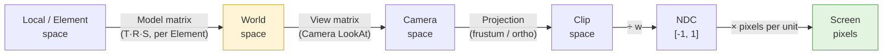
```mermaid
flowchart LR
    A["Local / Element<br/>space"] -- "Model matrix<br/>(T·R·S, per Element)" --> B["World<br/>space"]
    B -- "View matrix<br/>(Camera LookAt)" --> C["Camera<br/>space"]
    C -- "Projection<br/>(frustum / ortho)" --> D["Clip<br/>space"]
    D -- "÷ w" --> E["NDC<br/>[-1, 1]"]
    E -- "× pixels per unit" --> F["Screen<br/>pixels"]
    style B fill:#fff4d6,stroke:#c9a227
    style F fill:#e3f4e1,stroke:#4a9a45
```

Two engine classes own this maths:

| Class | Role |
|---|---|
| `ViewProjection` | Pure `P · V` projector, refreshed once per frame from the **current** camera matrix and perspective projection (so camera moves and perspective changes such as a zoom are both picked up). Also reused by shadow lookup and debug-vector drawing. |
| `ElementTransform` | Per-element `P · V · M` plus the **normal matrix** (`M` itself if orthogonal, `(Mᵀ)⁻¹` otherwise, so non-uniform scaling keeps normals correct). `setModel()` computes everything atomically. |

### One frame, step by step

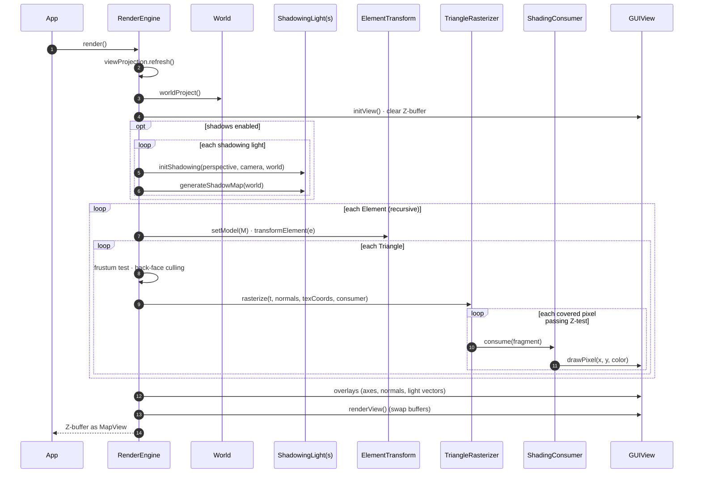
```mermaid
sequenceDiagram
    autonumber
    participant App
    participant RE as RenderEngine
    participant W as World
    participant SL as ShadowingLight(s)
    participant ET as ElementTransform
    participant TR as TriangleRasterizer
    participant SC as ShadingConsumer
    participant V as GUIView

    App->>RE: render()
    RE->>RE: viewProjection.refresh()
    RE->>W: worldProject()
    RE->>V: initView() · clear Z-buffer
    opt shadows enabled
        loop each shadowing light
            RE->>SL: initShadowing(perspective, camera, world)
            RE->>SL: generateShadowMap(world)
        end
    end
    loop each Element (recursive)
        RE->>ET: setModel(M) · transformElement(e)
        loop each Triangle
            RE->>RE: frustum test · back-face culling
            RE->>TR: rasterize(t, normals, texCoords, consumer)
            loop each covered pixel passing Z-test
                TR->>SC: consume(fragment)
                SC->>V: drawPixel(x, y, color)
            end
        end
    end
    RE->>V: overlays (axes, normals, light vectors)
    RE->>V: renderView()  (swap buffers)
    RE-->>App: Z-buffer as MapView
```

### Triangle triage

Before any pixel is produced, each triangle goes through cheap rejection tests:

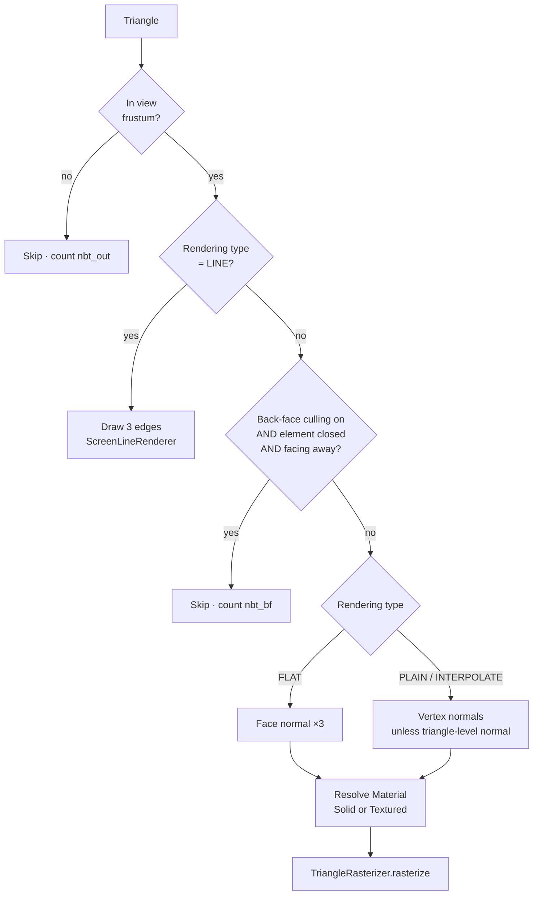
```mermaid
flowchart TD
    T[Triangle] --> Q1{In view<br/>frustum?}
    Q1 -- no --> OUT[Skip · count nbt_out]
    Q1 -- yes --> Q2{Rendering type<br/>= LINE?}
    Q2 -- yes --> WF[Draw 3 edges<br/>ScreenLineRenderer]
    Q2 -- no --> Q3{Back-face culling on<br/>AND element closed<br/>AND facing away?}
    Q3 -- yes --> BF[Skip · count nbt_bf]
    Q3 -- no --> Q4{Rendering type}
    Q4 -- FLAT --> N1[Face normal ×3]
    Q4 -- PLAIN / INTERPOLATE --> N2[Vertex normals<br/>unless triangle-level normal]
    N1 --> MAT[Resolve Material<br/>Solid or Textured]
    N2 --> MAT
    MAT --> RAST[TriangleRasterizer.rasterize]
```

---

## 5. Rasterization and fragments

The 2026 refactoring split the old monolithic `Rasterizer` into a **pure geometric core** and
**pluggable per-pixel logic**, the same separation a GPU makes between the fixed-function
rasterizer and a fragment shader.

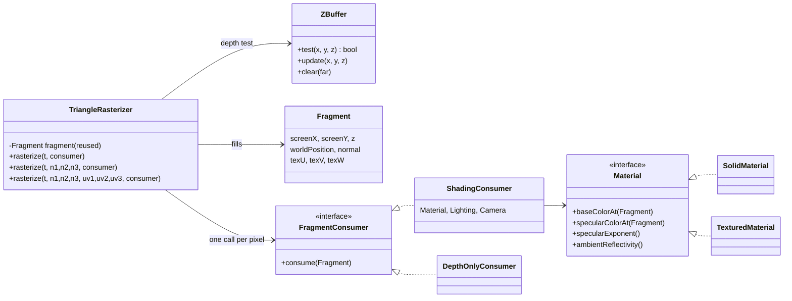
```mermaid
classDiagram
    direction LR
    class TriangleRasterizer {
      -Fragment fragment  (reused)
      +rasterize(t, consumer)
      +rasterize(t, n1,n2,n3, consumer)
      +rasterize(t, n1,n2,n3, uv1,uv2,uv3, consumer)
    }
    class ZBuffer {
      +test(x, y, z) bool
      +update(x, y, z)
      +clear(far)
    }
    class Fragment {
      screenX, screenY, z
      worldPosition, normal
      texU, texV, texW
    }
    class FragmentConsumer {
      <<interface>>
      +consume(Fragment)
    }
    class ShadingConsumer {
      Material, Lighting, Camera
    }
    class DepthOnlyConsumer
    class Material {
      <<interface>>
      +baseColorAt(Fragment)
      +specularColorAt(Fragment)
      +specularExponent()
      +ambientReflectivity()
    }
    TriangleRasterizer --> ZBuffer : depth test
    TriangleRasterizer --> Fragment : fills
    TriangleRasterizer --> FragmentConsumer : one call per pixel
    FragmentConsumer <|.. ShadingConsumer
    FragmentConsumer <|.. DepthOnlyConsumer
    ShadingConsumer --> Material
    Material <|.. SolidMaterial
    Material <|.. TexturedMaterial
```

**How a triangle is walked.** Vertices are sorted by screen Y, then the triangle is filled
**scan line by scan line** between its two active edges. Along each line, world position,
normal and texture coordinates are interpolated **with perspective correction**. Each pixel
is depth-tested (`ZBuffer.test`) *before* the consumer runs, so no shading work is spent on
hidden pixels.

**One rasterizer, two passes.** The same `TriangleRasterizer` serves both passes; only the
consumer changes:

| Pass | Consumer | Interpolates | Writes |
|---|---|---|---|
| Main camera | `ShadingConsumer` | position, normal, UV | colour + depth |
| Shadow map (per light) | `DepthOnlyConsumer` | depth only | depth |

**Zero allocation per pixel.** A single `Fragment` instance is mutated in place for every pixel,
and `ShadingConsumer` accumulates colour in a reused `RGBAccumulator`. The contract for
implementers: **never keep a reference to a `Fragment` after `consume()` returns**.

**Textures.** The rasterizer passes raw, undivided `(u, v, w)`; `TexturedMaterial` performs the
projective divide according to the triangle's texture orientation (isotropic, vertical or
horizontal) and multiplies the sample by the surface colour (`D × T`), so one texture can be
tinted differently per element.

---

## 6. Lighting model

For each fragment, `ShadingConsumer` evaluates a Phong-style sum:

```
K  =  D·T·A                                  ambient
    + Σᵢ  Cᵢ · D·T · max(0, N·Lᵢ)            diffuse, per light i
    + Σᵢ  Cᵢ · S  · max(0, Rᵢ·V)ⁿ            specular, per light i
                                             with Rᵢ = 2(N·Lᵢ)N − Lᵢ
```

| Symbol | Meaning | Source |
|---|---|---|
| `D`, `T` | Surface colour, texture sample | `Material.baseColorAt()` |
| `A` | Ambient light colour | `AmbientLight` |
| `Cᵢ` | Light colour × intensity at that point | `Light.getLightColorAtPoint()` |
| `N`, `Lᵢ`, `V` | Normal, direction to light, direction to eye | `Fragment`, `Light`, `Camera` |
| `S`, `n` | Specular colour and exponent | `Material` |

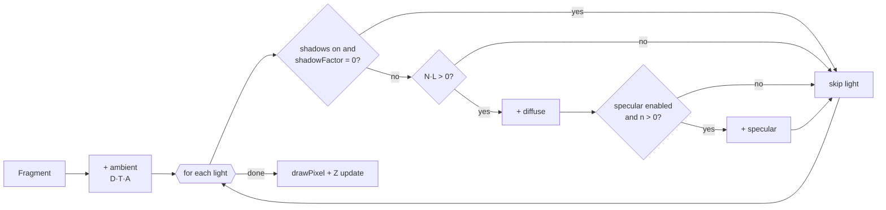
```mermaid
flowchart LR
    F[Fragment] --> AMB["+ ambient<br/>D·T·A"]
    AMB --> LOOP{{for each light}}
    LOOP --> SH{"shadows on and<br/>shadowFactor = 0?"}
    SH -- yes --> NEXT[skip light]
    SH -- no --> NL{"N·L > 0?"}
    NL -- no --> NEXT
    NL -- yes --> DIF["+ diffuse"]
    DIF --> SP{"specular enabled<br/>and n > 0?"}
    SP -- yes --> SPE["+ specular"]
    SP -- no --> NEXT
    SPE --> NEXT
    NEXT --> LOOP
    LOOP -- done --> PIX["drawPixel + Z update"]
```

Specular has two switches: a global one on `Lighting` (a "fast mode") and a per-surface one
(`specularExponent > 0`). Both must be on.

### Light types

| Light | Direction `L` | Intensity at a point | Shadows |
|---|---|---|---|
| `AmbientLight` | none | constant | n/a |
| `DirectionalLight` | constant (sun) | constant | ✅ orthographic shadow map |
| `PointLight` | towards its position | linear fall-off to 0 at `maxDistance` | ⏳ planned (cube map) |
| `SpotLight` | towards its position | point fall-off × **cone factor** | ⏳ planned (perspective map) |

The two attenuation laws, for a light with `maxDistance = 10` and a spot with inner half-angle
10° and outer half-angle 30°:

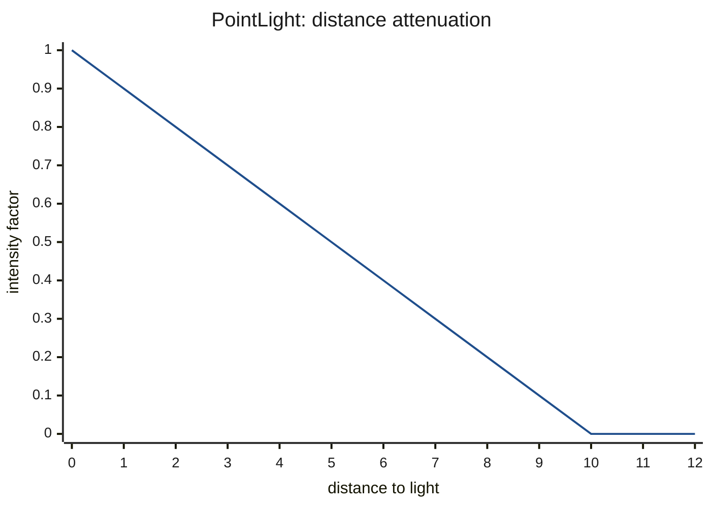
```mermaid
%%{init: {"theme": "base", "themeVariables": {"xyChart": {"plotColorPalette": "#1f4e8c", "backgroundColor": "#ffffff", "titleColor": "#1a1a1a", "xAxisLabelColor": "#1a1a1a", "yAxisLabelColor": "#1a1a1a", "xAxisLineColor": "#333333", "yAxisLineColor": "#333333"}}}}%%
xychart-beta
    title "PointLight: distance attenuation"
    x-axis "distance to light" [0, 1, 2, 3, 4, 5, 6, 7, 8, 9, 10, 11, 12]
    y-axis "intensity factor" 0 --> 1
    line [1.0, 0.9, 0.8, 0.7, 0.6, 0.5, 0.4, 0.3, 0.2, 0.1, 0.0, 0.0, 0.0]
```

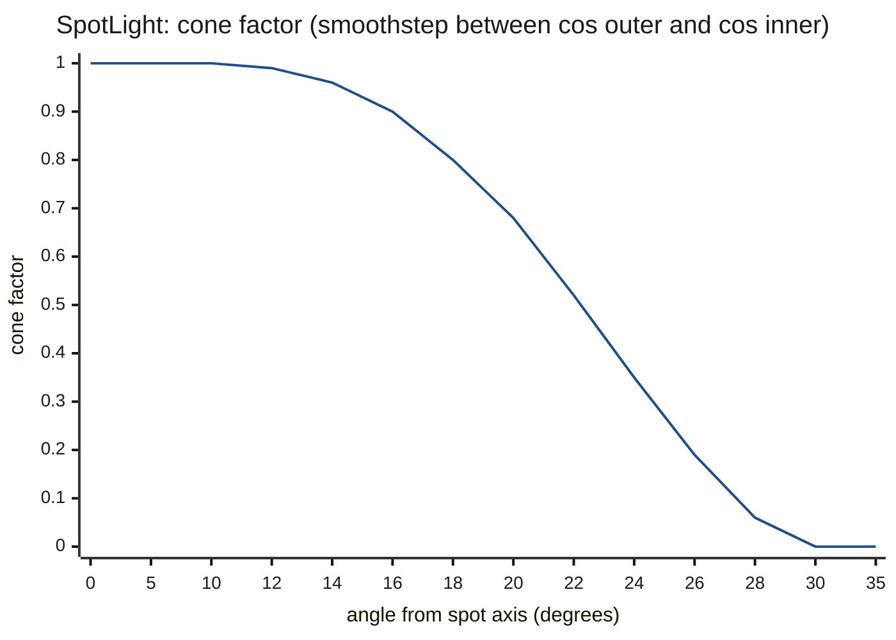
```mermaid
%%{init: {"theme": "base", "themeVariables": {"xyChart": {"plotColorPalette": "#1f4e8c", "backgroundColor": "#ffffff", "titleColor": "#1a1a1a", "xAxisLabelColor": "#1a1a1a", "yAxisLabelColor": "#1a1a1a", "xAxisLineColor": "#333333", "yAxisLineColor": "#333333"}}}}%%
xychart-beta
    title "SpotLight: cone factor (smoothstep between cos outer and cos inner)"
    x-axis "angle from spot axis (degrees)" [0, 5, 10, 12, 14, 16, 18, 20, 22, 24, 26, 28, 30, 35]
    y-axis "cone factor" 0 --> 1
    line [1.0, 1.0, 1.0, 0.99, 0.96, 0.90, 0.80, 0.68, 0.52, 0.35, 0.19, 0.06, 0.0, 0.0]
```

<p align="center">
  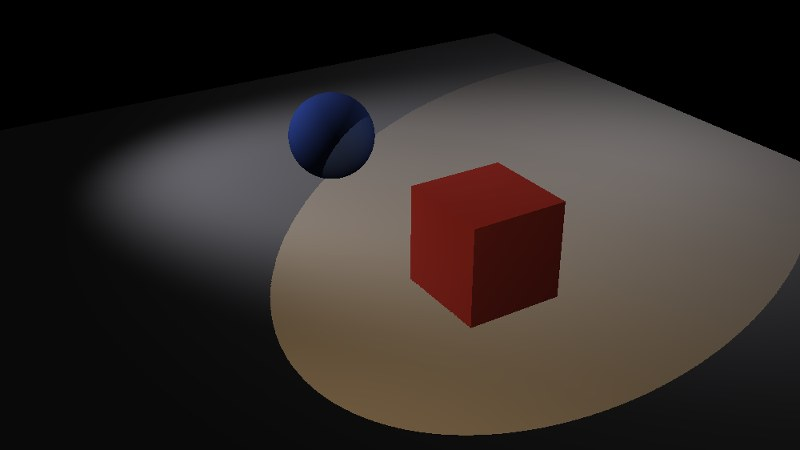<br/>
  <em>Soft-edged (white) and sharp-edged (warm) spot lights — <code>TestLightingSpot1</code>.</em>
</p>

---

## 7. Shadow mapping

Shadows use classic **two-pass shadow mapping**. Only directional lights cast shadows today.

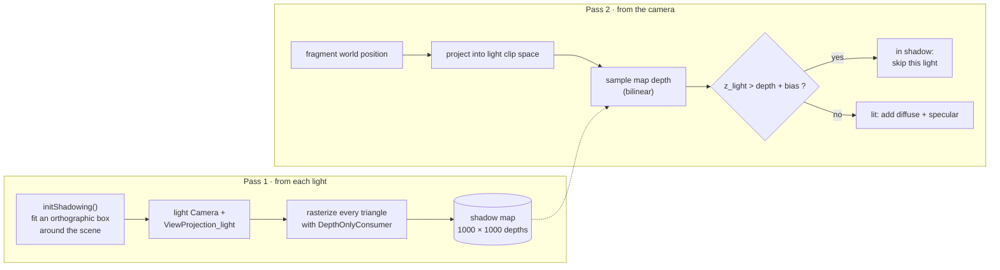
```mermaid
flowchart LR
    subgraph P1["Pass 1 · from each light"]
        direction TB
        A1["initShadowing()<br/>fit an orthographic box<br/>around the scene"] --> A2["light Camera +<br/>ViewProjection_light"]
        A2 --> A3["rasterize every triangle<br/>with DepthOnlyConsumer"]
        A3 --> A4[("shadow map<br/>1000 × 1000 depths")]
    end
    subgraph P2["Pass 2 · from the camera"]
        direction TB
        B1["fragment world position"] --> B2["project into light clip space"]
        B2 --> B3["sample map depth<br/>(bilinear)"]
        B3 --> B4{"z_light > depth + bias ?"}
        B4 -- yes --> B5["in shadow:<br/>skip this light"]
        B4 -- no --> B6["lit: add diffuse + specular"]
    end
    A4 -.-> B3
```

**Fitting the light box.** `DirectionalLight.initShadowing()` builds an orthonormal basis from the
light direction (Z-up hint, falling back to Y when the light is vertical), projects the eight
corners of the chosen bounding box onto it, and derives a tight orthographic volume. The box can be
the whole world (default), the view frustum, one element or a user-defined box
(`SHADOWING_BOX_*`).

**Fighting shadow acne.** The depth bias is expressed as a **world-space distance** (0.02 units),
converted to NDC for the current box, and **slope-scaled** by `1 / max(N·L, floor)` so grazing
surfaces (such as a floor under a low sun) get more tolerance than surfaces facing the light.

**Current trade-offs:** hard shadows (factor 0 or 1, no PCF), fixed map resolution, and point and
spot lights do not cast shadows yet (they still light the scene correctly when shadows are enabled).

<p align="center">
  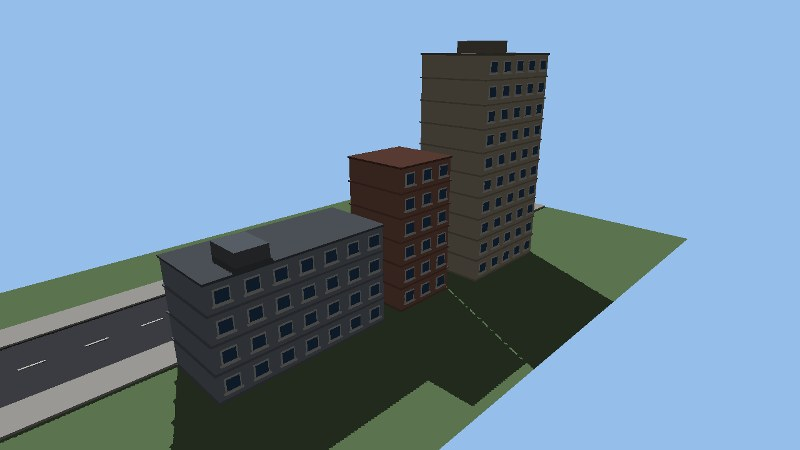<br/>
  <em>Directional-light shadows in the <code>UrbanScape</code> demo.</em>
</p>

---

## 8. Configuration: the two contexts

All render parameters live in two objects passed to the `RenderEngine`. Swapping a context
re-renders the **same scene** differently, from a cheap wireframe preview to full shading with
textures and shadows.

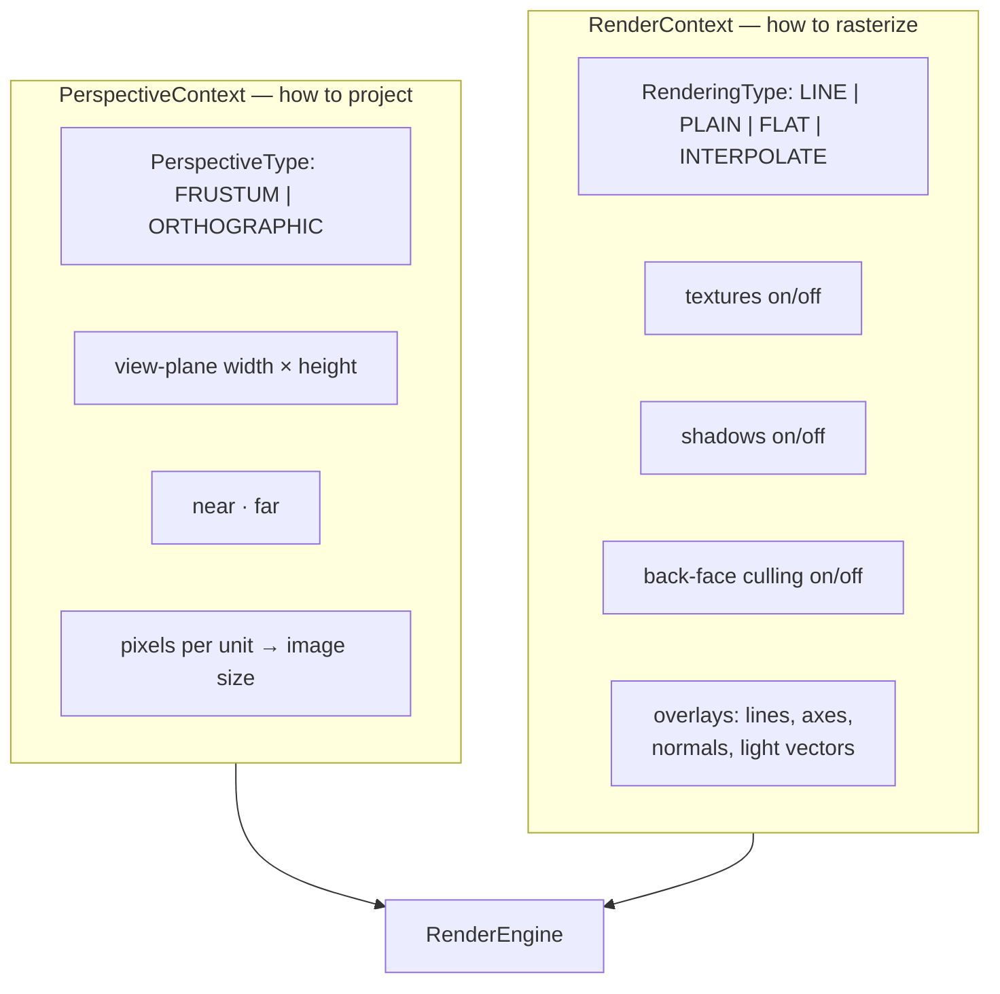
```mermaid
flowchart TB
    subgraph PC["PerspectiveContext — how to project"]
        direction LR
        p1["PerspectiveType: FRUSTUM | ORTHOGRAPHIC"]
        p2["view-plane width × height"]
        p3["near · far"]
        p4["pixels per unit → image size"]
    end
    subgraph RC["RenderContext — how to rasterize"]
        direction LR
        r1["RenderingType: LINE | PLAIN | FLAT | INTERPOLATE"]
        r2["textures on/off"]
        r3["shadows on/off"]
        r4["back-face culling on/off"]
        r5["overlays: lines, axes,<br/>normals, light vectors"]
    end
    PC --> RE[RenderEngine]
    RC --> RE
```

| Rendering type | Normals used | Look | Relative cost |
|---|---|---|---|
| `RenderingType.LINE` | none | wireframe | ● |
| `RenderingType.FLAT` | one per face | faceted | ●●● |
| `RenderingType.PLAIN` | per vertex unless face normal | legacy mode | ●●● |
| `RenderingType.INTERPOLATE` | per vertex, per pixel | smooth | ●●●● |

The on/off options are booleans with chainable setters (`setShadowing(true).setTextureProcessing(true)`).
Presets cover common cases, for example `RENDER_STANDARD_INTERPOLATE`,
`RENDER_STANDARD_INTERPOLATE_SHADOWS` and `RENDER_STANDARD_PLAIN`. They are **immutable**
(setters throw `IllegalStateException`): copy one with `new RenderContext(preset)` to customize it.

`PerspectiveContext` currently holds both the lens (the `Perspective`: view volume and projection,
in world units) and the raster size (pixels, derived through a pixels-per-unit ratio). The pixel
size is fixed at construction; changing the `Perspective` afterwards (e.g. `setWidth()` to zoom)
maps the new volume onto the same image. Splitting it into a `Perspective` and a `Viewport` is
planned (see the roadmap).

---

## 9. Extension points

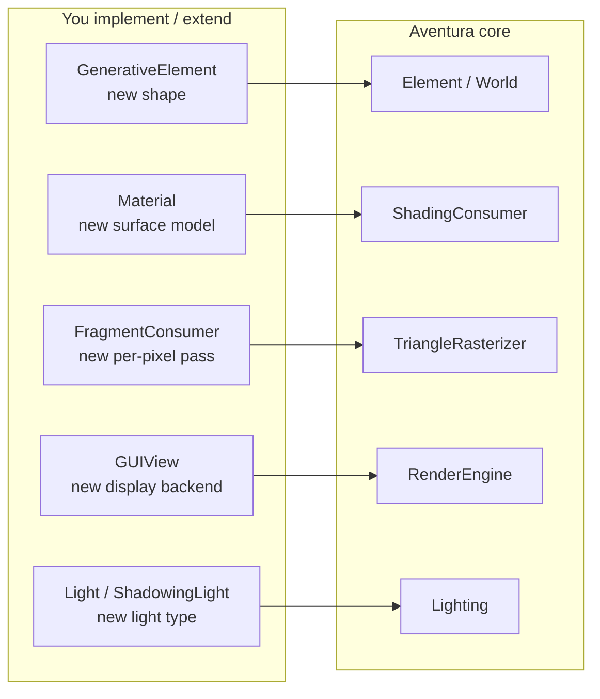
```mermaid
flowchart LR
    subgraph EXT["You implement / extend"]
        E1["GenerativeElement<br/>new shape"]
        E2["Material<br/>new surface model"]
        E3["FragmentConsumer<br/>new per-pixel pass"]
        E4["GUIView<br/>new display backend"]
        E5["Light / ShadowingLight<br/>new light type"]
    end
    subgraph CORE["Aventura core"]
        C1[Element / World]
        C2[ShadingConsumer]
        C3[TriangleRasterizer]
        C4[RenderEngine]
        C5[Lighting]
    end
    E1 --> C1
    E2 --> C2
    E3 --> C3
    E4 --> C4
    E5 --> C5
```

| To add… | Extend / implement | What you write | Example |
|---|---|---|---|
| A shape | `GenerativeElement` | `generateVertices()`, `generateTriangles()` (compiler-enforced); override `calculateNormals()` for smooth shapes | `Sphere`, `Torus`, `Trellis` |
| A material | `Material` | `baseColorAt(Fragment)` etc.; the fragment gives position and normal for triplanar, Fresnel… | `TexturedMaterial` |
| A pass | `FragmentConsumer` | `consume(Fragment)` — e.g. a normal buffer, an ID buffer for picking | `DepthOnlyConsumer` |
| A display | `GUIView` | `initView`, `drawPixel`, `drawLine`, `renderView` | `SwingView` |
| A light | `Light` or `ShadowingLight` | `getLightVectorAtPoint`, `getIntensity` (+ shadow map) | `SpotLight` |

Custom geometry without subclassing is also possible: feed `Element.addVertex()` and
`Element.addTriangle()` directly.

---

## 10. Quality and testing

Two complementary test families run from Maven:

- **Unit tests (JUnit 4, headless)** — run by `mvn test`, no display needed.
- **Visual test programs** — ~70 `main()` classes in `com.aventura.test`, checked by eye
  (shapes, meshes, textures, lighting, shadow maps, rasterizer experiments).

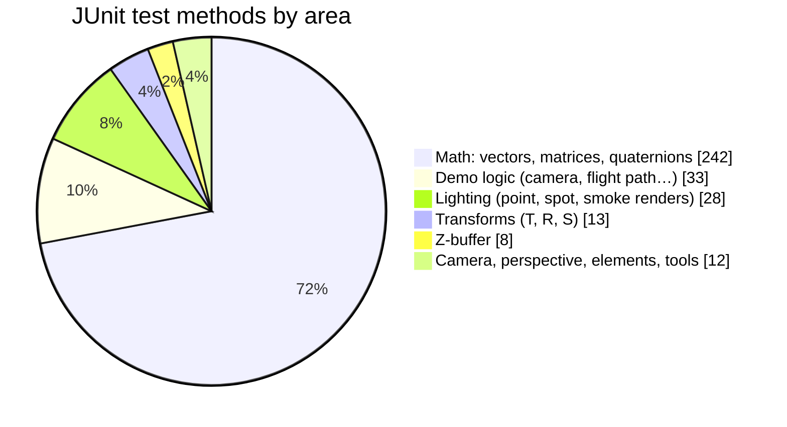
```mermaid
pie showData
    title JUnit test methods by area
    "Math: vectors, matrices, quaternions" : 242
    "Demo logic (camera, flight path…)" : 33
    "Lighting (point, spot, smoke renders)" : 28
    "Transforms (T, R, S)" : 13
    "Z-buffer" : 8
    "Camera, perspective, elements, tools" : 12
```

The math library is the most heavily tested part because every other stage depends on it.
Lighting has both analytical tests (attenuation curves, cone factor) and **smoke renders** of each
light type with and without shadows. Diagnostic counters (`RasterizerStats`, triangle
in/out/back-face counts, shadow-map stats) and the `Tracer` utility help investigate regressions.

---

## 11. History, limitations and roadmap

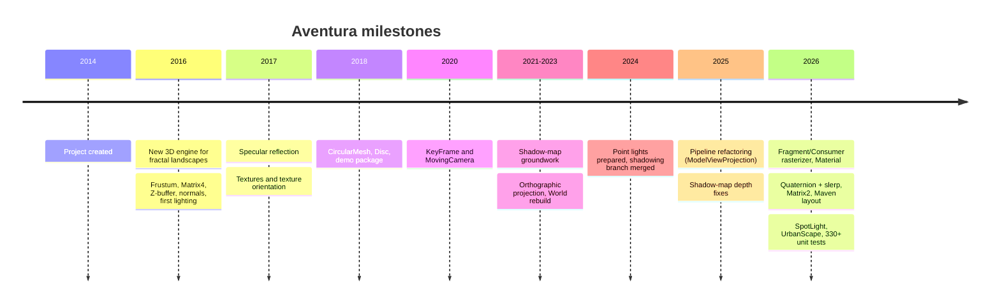
```mermaid
timeline
    title Aventura milestones
    2014 : Project created
    2016 : New 3D engine for fractal landscapes
         : Frustum, Matrix4, Z-buffer, normals, first lighting
    2017 : Specular reflection
         : Textures and texture orientation
    2018 : CircularMesh, Disc, demo package
    2020 : KeyFrame and MovingCamera
    2021-2023 : Shadow-map groundwork
              : Orthographic projection, World rebuild
    2024 : Point lights prepared, shadowing branch merged
    2025 : Pipeline refactoring (ModelViewProjection)
         : Shadow-map depth fixes
    2026 : Fragment/Consumer rasterizer, Material
         : Quaternion + slerp, Matrix2, Maven layout
         : SpotLight, UrbanScape, 330+ unit tests
```

Commit activity reflects this: two intense phases (2016–2017 and 2024–2026) around a quieter period.

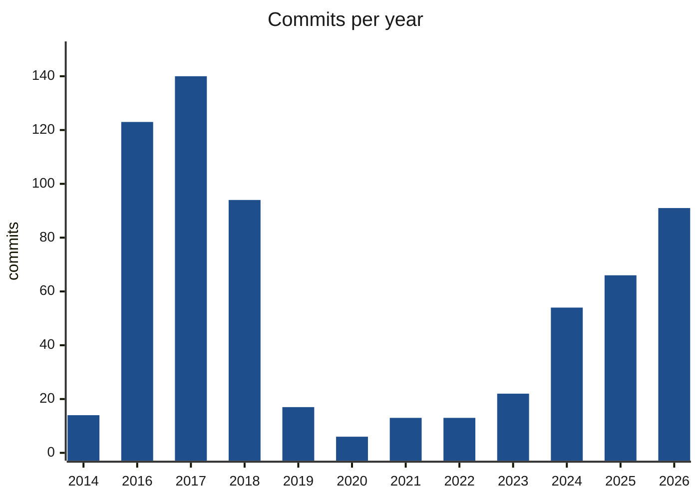
```mermaid
%%{init: {"theme": "base", "themeVariables": {"xyChart": {"plotColorPalette": "#1f4e8c", "backgroundColor": "#ffffff", "titleColor": "#1a1a1a", "xAxisLabelColor": "#1a1a1a", "yAxisLabelColor": "#1a1a1a", "xAxisLineColor": "#333333", "yAxisLineColor": "#333333"}}}}%%
xychart-beta
    title "Commits per year"
    x-axis [2014, 2016, 2017, 2018, 2019, 2020, 2021, 2022, 2023, 2024, 2025, 2026]
    y-axis "commits" 0 --> 150
    bar [14, 123, 140, 94, 17, 6, 13, 13, 22, 54, 66, 91]
```

### Known limitations

| Area | Current state |
|---|---|
| Performance | Single-threaded CPU rasterizer; built for clarity, not large scenes |
| Shadows | Directional lights only; hard edges; fixed 1000² map |
| Lights | Not drawn in the scene (no halo or lens effect) |
| Display | `SwingView` is the only backend |
| Assets | Textures loaded from file paths, not from the classpath |
| API | `RenderingType.MONOCHROME` declared but not implemented |
| API | `PerspectiveContext` mixes lens and pixel size (see §8) |

### Roadmap (candidate items)


```mermaid
flowchart LR
    subgraph NOW["Near term"]
        n1[Spot light shadows<br/>perspective shadow map]
        n2[Soft shadows · PCF]
        n3[Shadow-map size in<br/>RenderContext]
        n4[Perspective / Viewport<br/>split]
    end
    subgraph NEXT["Mid term"]
        m1[Point light shadows<br/>cube map, 6 faces]
        m2[Classpath texture loading]
        m3[Multi-threaded rasterization<br/>by screen tiles]
    end
    subgraph LATER["Ideas"]
        l1[Other GUIView backends<br/>JavaFX, image sequence]
        l2[Visible light sources]
        l3[Model import<br/>OBJ]
    end
    NOW --> NEXT --> LATER
```

---

## 12. Contributor conventions

- **Z is up.** Cameras are built with `Vector4.zAxis()` as the up vector.
- **Directional lights are defined by their propagation direction** (from the light towards the scene).
- **New shapes extend `GenerativeElement`**, not `Element`, so missing geometry methods fail at compile time.
- **Never retain a `Fragment`** (or its vectors) after `consume()` returns; copy values out.
- **Transform order is S → R → T** (`M = T · R · S`), composed parent-first down the tree.
- **Refresh, don't cache:** `Camera.updateCamera()` mutates its matrix in place and
  `Perspective` setters replace its projection, so derived matrices go through
  `ViewProjection.refresh()` once per frame.
- **Run demos from the project root**: texture paths are relative to the working directory.
- **Tests must run headless**: Surefire sets `-Djava.awt.headless=true`.

---

*Aventura is © 2014–2026 Olivier Barry, released under the [MIT License](../LICENSE.md).*
