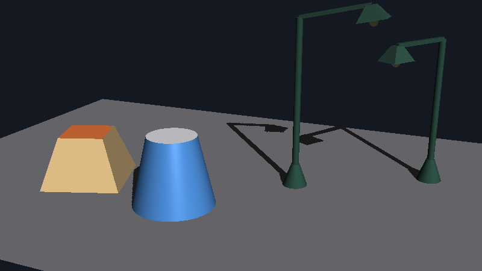
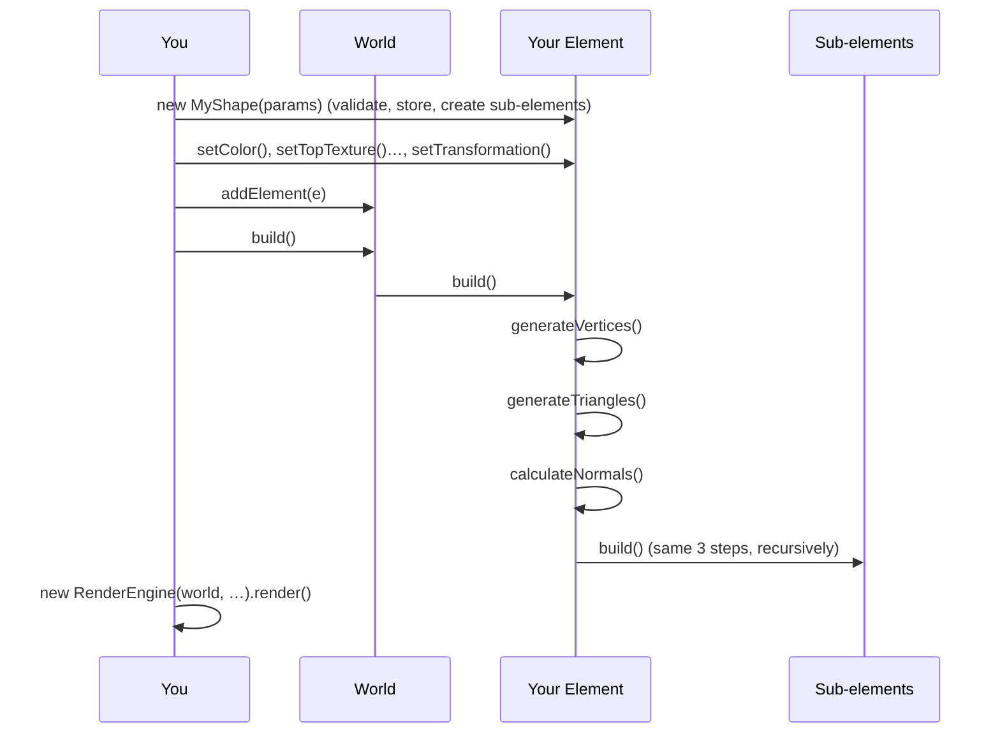
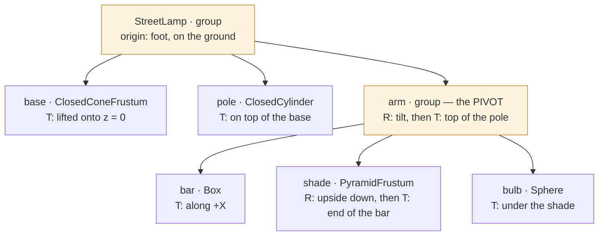

# Aventura — Geometry Cookbook

How to create your own geometry: a new shape, a richer version of an existing one, or a complex
object assembled from simpler ones.

| | |
|---|---|
| **For** | Programmers who build scenes in code and need a shape Aventura does not provide |
| **Prerequisites** | The [README](../README.md) "Hello, Aventura" example; [DESIGN.md §3](DESIGN.md#3-domain-model) for the big picture |
| **Examples** | [`src/test/java/com/aventura/cookbook`](../src/test/java/com/aventura/cookbook): every class shown here is compiled and tested ([`TestGeometryCookbook`](../src/test/java/com/aventura/cookbook/TestGeometryCookbook.java)) |

<p align="center">
  
</p>

*The examples of this cookbook, rendered by [`CookbookGallery`](../src/test/java/com/aventura/cookbook/CookbookGallery.java):
a `PyramidFrustum` written from scratch (recipe 1), a `ClosedConeFrustum` obtained by inheritance
(recipe 3), and two `StreetLamp` assemblies (recipe 4), one of them turned and with a tilted arm.*

---

## Contents

1. [The model in five minutes](#1-the-model-in-five-minutes)
2. [The contracts](#2-the-contracts)
3. [The toolbox](#3-the-toolbox)
4. [Recipe 1 — A new primitive: the pyramid frustum](#4-recipe-1--a-new-primitive-the-pyramid-frustum)
5. [Recipe 2 — Smooth surfaces](#5-recipe-2--smooth-surfaces)
6. [Recipe 3 — Enriching an existing shape by inheritance](#6-recipe-3--enriching-an-existing-shape-by-inheritance)
7. [Recipe 4 — Assembling elements into a complex object](#7-recipe-4--assembling-elements-into-a-complex-object)
8. [Testing your geometry](#8-testing-your-geometry)
9. [Pitfalls](#9-pitfalls)
10. [Known issues of the built-in shapes](#10-known-issues-of-the-built-in-shapes)

---

## 1. The model in five minutes

**An `Element` is a node of the scene tree.** It owns a list of `Vertex` objects, a list of
`Triangle`s made of those vertices, optionally a list of sub-`Element`s, and a transformation that
places it in its parent (or in the world, for a root element).

```
World
 └── Element                 transformation: its frame → world frame
      ├── Vertex × n         positions in the element's LOCAL frame
      ├── Triangle × m       3 vertices each, + optional normal, color, texture coordinates
      └── Element × k        sub-elements: transformation = their frame → this element's frame
```

**Everything you write is in the local frame.** You generate vertices around the origin of your
element, as if it were alone in the universe. Placing it (scale, rotation, translation), and
placing it relative to its parent, is the job of transformations, applied by the engine at render
time: `worldPos = M(root) · … · M(parent) · M(element) · localPos`, with each `M = T · R · S`.

**A shape is generated, not stored.** A shape class stores its *parameters* (a radius, a number of
segments) and generates vertices and triangles from them when `build()` is called:



What the engine then does for you, every frame: transform vertices and normals with the full
matrix of each element, cull back faces of closed elements, discard triangles outside the view,
rasterize, shade, and render
the shadow maps — for sub-elements too. Your element never deals with the camera, the lights or
the pixels.

**Conventions** (shared by all built-in shapes — follow them, users will expect them):

| Convention | Rule |
|---|---|
| Axes | Right-handed, **Z up** |
| Local origin | The center of the shape's bounding box (e.g. a `Box` spans `[-x/2, x/2] × [-y/2, y/2] × [-z/2, z/2]`) |
| Face names (`Shape` interface) | top +Z, bottom −Z, left −Y, right +Y, front +X, back −X — before any transformation |
| Units | None imposed; the demos use 1 unit ≈ 1 meter (or 1 floor in `UrbanScape`) |
| Tessellation of round shapes | `half_seg` = half the number of segments of a full circle |

---

## 2. The contracts

A new element must fulfill these contracts. Most are not checked by the compiler: breaking one
typically gives a black face, a hole, a missing shape or a `NullPointerException` deep inside the
engine. [`ElementContractChecker`](#8-testing-your-geometry) checks the verifiable ones.

### C1 — Extend `GenerativeElement` for a shape, `Element` for a group

`GenerativeElement` redeclares `generateVertices()` and `generateTriangles()` as abstract: forget
one and the class does not compile. `Element` itself has empty defaults for them, which is right
for a **group** (an element with no geometry of its own, that only holds sub-elements) and wrong
for a shape (it would silently be empty).

### C2 — The constructor validates and stores parameters; it creates no geometry

Validate the parameters in the constructor (`IllegalArgumentException`), so that the error points
at the caller's line rather than at `build()`. Store them in fields. Set the element's closedness
(`super(name, isClosed)`). Create the **sub-elements** here (C9). Do **not** create vertices or
triangles: `build()` does, and appearance setters called after the constructor (C8) must be able to
influence them.

### C3 — `generateVertices()` creates every vertex through the element

Create vertices with `createVertex(Vector4)`, `createVertexMesh(n, p)`, or a mesh helper built with
the element (`new RectangleMesh(this, n, p)`…): all of them register the vertex in the element's
list, and **only registered vertices are transformed by the engine**. A vertex created with
`new Vertex(...)` and put in a triangle without `addVertex()` is never projected: the renderer fails
on it. Positions are **points**: homogeneous coordinate `w = 1`.

Keep whatever `generateTriangles()` will need (the vertex arrays, the meshes) in fields.

### C4 — `generateTriangles()` only connects existing vertices

It creates the triangles from the vertices of `generateVertices()` and adds them to the element
(`addTriangle()`, or a mesh's `createTriangles()`). It must not create vertices: `rebuild()` clears
the triangles and calls it again, *without* calling `generateVertices()` (that is how a `Trellis`
whose heights changed is updated). It may assume `generateVertices()` has run.

### C5 — Triangles are wound counter-clockwise, seen from outside

The orientation of a triangle is its **winding**: the face normal is `V1V2 × V1V3`
(`Triangle.calculateNormal()`), so the vertices must turn counter-clockwise when the triangle is
seen from the side it faces. The engine relies on it for:

- **lighting**: a surface is lit only on the side its normal points to (`N · L > 0`);
- **back-face culling** of closed elements (C7): a triangle whose normal points away from the camera is skipped;
- the **shadow-map bias**, which scales with the angle between the normal and the light.

A triangle wound the wrong way is black under a light that should light it, lit when it should be
dark, or disappears when culling is on.

### C6 — Normals: flat by default, smooth on request, always for your own triangles only

Two possibilities per triangle:

- **Flat** (sharp edges: boxes, pyramids, discs). Do nothing: the inherited
  `Element.calculateNormals()` computes one normal per triangle from its winding and marks it as a
  triangle normal. A zero-area triangle would get a NaN normal: avoid them (C2 validation).
- **Smooth** (curved surfaces: cylinders, spheres). Override `calculateNormals()` and give **every
  vertex** of the smooth triangles a **unit** normal (`Vertex.setNormal(Vector3)`), pointing
  outwards (same side as the winding). Do not set triangle normals on them. See
  [recipe 2](#5-recipe-2--smooth-surfaces).

In both cases, `calculateNormals()` handles **this element's triangles only**: sub-elements get
their own `build()`, hence their own `calculateNormals()`. Never recurse into sub-elements from it
(the rule is spelled out on `Generable.calculateNormals()`).

A vertex has one normal: where the surface has a sharp edge (the rim of a closed cylinder), use
**separate vertices** on each side of the edge — in practice, separate meshes or sub-elements.

### C7 — `isClosed` only for a watertight, consistently wound surface

A closed element gets back-face culling (enabled by default in the `RenderContext`): its triangles
facing away from the camera are skipped, which is only correct if nothing can be seen through the
surface. Declare an element closed only if its surface, **together with its sub-elements**, has no
hole and fulfills C5 everywhere. Open surfaces (a disc, a cone without its base, a terrain) must
stay open: both of their sides are then rasterized.

### C8 — Appearance: `null` inherits; setters record and must be called before `build()`

- **Colors** resolve from the most specific level: triangle › element › parent element › … ›
  world. Leave a color `null` to inherit it (a mesh's `setCol(null)` gives its triangles no color).
  `Vertex.setColor()` exists but is **ignored** by the renderer.
- **Textures**: each textured triangle carries the texture and 3 texture coordinates
  `Vector4(u, v, 0, 1)` with `u, v` in `[0, 1]` (`Triangle.setTexture(tex, t1, t2, t3)`). The mesh
  helpers compute them for you when created with a texture.
- **The `Shape` setters** (`setTopColor()`, `setFrontTexture()`…) only record the value, used
  when the geometry is generated: they must be called **before `build()`**. Return `this` when the
  face exists; the inherited default returns `null`, meaning "no such face on this shape".

### C9 — Sub-elements: created in the constructor, one parent each, placed in the parent's frame

Create them in the constructor and attach them with `addElement()` (which sets their parent). Each
sub-element is placed by **its own transformation, expressed in the parent's frame**. An `Element`
instance has exactly one parent: to show "the same" part twice, create two instances. You may set
transformations before or after `addElement()`, on the child or on the parent: they are propagated
down the tree either way.

### C10 — Lifecycle: `build()` once, `rebuild()` after moving vertices

`build()` generates the geometry; calling it twice duplicates every vertex and triangle.
`World.build()` builds all root elements, which build their sub-elements: do not also call
`build()` on an element of a world you build. After moving vertices of a built element, call
`rebuild()` (triangles and normals are regenerated). Do not override `build()` or `rebuild()`:
override the three steps.

### Checklist

| # | Contract | Checked by |
|---|---|---|
| C1 | `GenerativeElement` for a shape, `Element` for a group | compiler |
| C2 | Constructor validates and stores; no geometry | review, unit test |
| C3 | Vertices created through the element, `w = 1` | `ElementContractChecker.check()` |
| C4 | `generateTriangles()` creates no vertex (repeatable) | unit test with `rebuild()` |
| C5 | Counter-clockwise from outside | `signedVolume()` (closed shapes), rendering |
| C6 | Flat, or unit outward vertex normals; own triangles only | `check()` |
| C7 | `isClosed` only if watertight | `signedVolume()` |
| C8 | Colors `null` = inherit; setters before `build()`; texture coordinates | `check()` (texture coordinates), unit test |
| C9 | Sub-elements in the constructor, one parent | `check()` (parent) |
| C10 | `build()` once, `rebuild()` after edits | unit test |

---

## 3. The toolbox

### Mesh helpers (`com.aventura.model.world.triangle`)

A mesh helper holds a grid (or a ring, or a fan) of vertices of your element and turns it into
triangles, with texture coordinates and a color. It does not compute positions: you set them.

| Helper | Vertices | Triangles | Winding (face normal) | Used by |
|---|---|---|---|---|
| `RectangleMesh` | grid `a[i][j]`, `n × p` | 2 per cell: `(a[i][j], a[i+1][j], a[i+1][j+1])`, `(a[i+1][j+1], a[i][j+1], a[i][j])` | `U × V`, U = direction of `i`, V = direction of `j` | `Box`, `Cylinder`, `Sphere`, `Torus`, `Trellis` |
| `FanMesh` | a row of base vertices + a summit | `(base[i], base[i+1], summit)` | `(base[i+1] − base[i]) × (summit − base[i])` | `Pyramid`, `Cone` |
| `CircularMesh` | a ring of `n` vertices + a center | `(center, v[i], v[i+1])` | the side from which the ring turns counter-clockwise | `Disc` |
| `FullMesh` | a main grid + one center vertex per cell | 4 per cell, around the center | same as `RectangleMesh` | `ConeFrustum` |

The practical rule for `RectangleMesh` (and `FullMesh`): **choose the first index along U and the
second along V so that U × V points outwards.** For a side face, take V upwards (textures then stand
upright, as on a `Box`) and U horizontal, turning counter-clockwise around the shape seen from above.

A mesh can also wrap vertices you already created: `new RectangleMesh(this, Vertex[][] grid, tex)`.
This is how a `Box` shares its 8 corners between its 6 faces.

### Transformations (`com.aventura.math.transform`)

| Class | Builds | Example |
|---|---|---|
| `Translation` | `T` | `new Translation(new Vector3(x, y, z))`, `new Translation(Vector3.zAxis(), h)` |
| `Rotation` | `R`, angle in **radians**, right-hand rule around the axis | `new Rotation((float) Math.PI / 2, Vector3.zAxis())` |
| `Scaling` | `S` (a `Matrix4`, not a `Transformation`: wrap it) | `new Transformation(new Scaling(1, 1, 3))` |
| `Transformation` | `T · R · S` | `new Transformation(scaling, rotation, translation)` |

On an element:

- `setTransformation(m)` **replaces** the element's own matrix.
- `combineTransformation(m)` **applies `m` after** the current matrix (`M ← m · M`). So
  `setTransformation(R); combineTransformation(T)` gives `T · R`: rotate around the element's own
  origin, then move. This reads in the order things happen, and is the idiom used in this cookbook.
- `getTransformation()` returns the **full** matrix (from the element's frame to the world), not
  the element's own one.

### Vectors (`com.aventura.math.vector`)

- `Vector4` is homogeneous: `w = 1` for a point, `w = 0` for a direction. A point minus a point is a
  direction (`w = 0`); a point minus a direction is still a point (`w = 1`).
- `Vector4.normalize()` normalizes **all four** components: normalize a `Vector3` (`v.V3().normalize()`),
  or a `Vector4` whose `w` is 0, never a point.
- `Vector3.xAxis()`, `yAxis()`, `zAxis()` and the opposite `xOppAxis()`… exist on both classes.

---

## 4. Recipe 1 — A new primitive: the pyramid frustum

Aventura has a `Pyramid` and a `ConeFrustum`, but no truncated pyramid — the shape of a lamp shade,
a plinth, a roof or a tower base. Full code:
[`PyramidFrustum.java`](../src/test/java/com/aventura/cookbook/PyramidFrustum.java).

### Step 1 — Draw it, choose the frame and the parameters

```
            top face: topX × topY, at z = +height/2
               +--------+
              /        /|
      +------+--------+ |        4 trapezoidal side faces
      |       \      /  |
      |        +----+   +
      |                /
      +---------------+          bottom face: bottomX × bottomY, at z = -height/2
```

Frame: centered on the origin, Z up, faces named as in `Shape` (§1). Parameters: 5 dimensions.
Geometry: 8 vertices, 6 planar quadrilateral faces of 2 triangles = 12 triangles, closed.

### Step 2 — The constructor (C1, C2)

```java
public class PyramidFrustum extends GenerativeElement {                // C1

	protected final float bottomX, bottomY, topX, topY, height;

	public PyramidFrustum(float bottomX, float bottomY, float topX, float topY, float height) {
		super("pyramid frustum", true);                                   // closed (C7)
		if (bottomX <= 0 || bottomY <= 0 || topX <= 0 || topY <= 0 || height <= 0) {
			throw new IllegalArgumentException("PyramidFrustum dimensions must be > 0: ...");
		}
		this.bottomX = bottomX;                                           // store, no geometry (C2)
		...
	}
```

A zero-sized top is rejected rather than accepted: it would create zero-area side triangles
with a NaN flat normal (the `Pyramid` class exists for that case).

### Step 3 — The vertices (C3)

```java
	protected Vertex[][] bottom, top; // [i][j]: i = 0 for -X, 1 for +X ; j = 0 for -Y, 1 for +Y

	@Override
	public void generateVertices() {
		float bx = bottomX / 2, by = bottomY / 2, tx = topX / 2, ty = topY / 2, h = height / 2;
		bottom = new Vertex[2][2];
		top = new Vertex[2][2];
		for (int i = 0; i < 2; i++) {
			for (int j = 0; j < 2; j++) {
				float sx = i == 0 ? -1 : 1, sy = j == 0 ? -1 : 1;
				bottom[i][j] = createVertex(new Vector4(sx * bx, sy * by, -h, 1)); // registered, w = 1
				top[i][j]    = createVertex(new Vector4(sx * tx, sy * ty,  h, 1));
			}
		}
		// ... faces: see step 4
	}
```

Each corner is created **once** and shared by the 3 faces that meet there. This is right for flat
shading: the normal is carried by the triangles, not by the vertices. (A smooth shape could not
share them across a sharp edge, see C6.)

### Step 4 — The faces and their winding (C5)

Each face is a `RectangleMesh` on 2 × 2 corners. Its triangles face `U × V`, where U goes from
`a00` to `a10` (first index) and V from `a00` to `a01` (second index). So, for each face, pick U and
V such that `U × V` is the outward direction:

| Face | Outward | U (1st index) | V (2nd index) | Check |
|---|---|---|---|---|
| top | +Z | +X | +Y | X × Y = Z |
| bottom | −Z | +Y | +X | Y × X = −Z |
| left | −Y | +X | up | X × Z = −Y |
| right | +Y | −X | up | −X × Z = +Y |
| front | +X | +Y | up | Y × Z = X |
| back | −X | −Y | up | −Y × Z = −X |

("up" is the slanted edge from the bottom to the top face: it is not exactly Z, but the cross
product keeps pointing to the same side.)

```java
		//                    a00           a10 (along U)  a01 (along V)  a11
		topMesh    = face(top[0][0],    top[1][0],    top[0][1],    top[1][1],    topTex,    topCol);
		bottomMesh = face(bottom[0][0], bottom[0][1], bottom[1][0], bottom[1][1], bottomTex, bottomCol);
		leftMesh   = face(bottom[0][0], bottom[1][0], top[0][0],    top[1][0],    leftTex,   leftCol);
		rightMesh  = face(bottom[1][1], bottom[0][1], top[1][1],    top[0][1],    rightTex,  rightCol);
		frontMesh  = face(bottom[1][0], bottom[1][1], top[1][0],    top[1][1],    frontTex,  frontCol);
		backMesh   = face(bottom[0][1], bottom[0][0], top[0][1],    top[0][0],    backTex,   backCol);

	private RectangleMesh face(Vertex a00, Vertex a10, Vertex a01, Vertex a11, Texture tex, Color col) {
		RectangleMesh mesh = new RectangleMesh(this, new Vertex[][] { { a00, a01 }, { a10, a11 } }, tex);
		mesh.setCol(col); // null: inherit the element's color (C8)
		return mesh;
	}
```

The meshes are created in `generateVertices()` (they reference vertices and read the per-face
appearance) and kept in fields for the next step.

### Step 5 — The triangles (C4) and the normals (C6)

```java
	@Override
	public void generateTriangles() {
		topMesh.createTriangles(RectangleMesh.MESH_ORIENTED_TRIANGLES);
		... // the 5 other faces
	}
```

`calculateNormals()` is **not** overridden: each face is planar with sharp edges, so the default
flat normal per triangle is exact.

### Step 6 — The `Shape` API (C8)

```java
	@Override public Element setTopColor(Color c)        { topCol = c;   return this; }
	@Override public Element setTopTexture(Texture tex)  { topTex = tex; return this; }
	... // 10 more, one per face and kind
```

They record the value read by `generateVertices()`: `new PyramidFrustum(...).setTopColor(RED)`
then `build()`.

### Step 7 — Test it

```java
	PyramidFrustum f = new PyramidFrustum(2, 1, 1, 0.5f, 1);
	f.build();
	assertEquals(12, f.getNbTriangles());
	assertEquals(List.of(), ElementContractChecker.check(f));                 // C3, C6, C8
	assertEquals(f.getVolume(), ElementContractChecker.signedVolume(f), 1e-5f); // C5, C7
```

The last line is the most useful test of a closed shape: see [§8](#8-testing-your-geometry).

---

## 5. Recipe 2 — Smooth surfaces

A curved surface is approximated by flat triangles; smooth shading hides the facets by giving each
**vertex** the normal of the *ideal* surface at that point, which the rasterizer interpolates across
the triangle (`RenderingType.INTERPOLATE`; `FLAT` still uses one normal per triangle).

The pattern, from `Cylinder`:

```java
	@Override
	public void calculateNormals() {
		for (int i = 0; i <= half_seg * 2; i++) {
			// Normal of the ideal cylinder: horizontal, from the axis to the vertex
			Vector3 n = rectangleMesh.getVertex(i, 0).getPos().minus(bottom_center).V3();
			n.normalize();                                   // unit (C6)
			rectangleMesh.getVertex(i, 0).setNormal(n);      // bottom vertex
			rectangleMesh.getVertex(i, 1).setNormal(n);      // top vertex, same normal
		}
		// No call to super.calculateNormals(): it would set flat triangle normals, which win over vertex normals.
		// No recursion into sub-elements (C6).
	}
```

Rules of thumb:

- **Derive the normal from the ideal surface, not from the triangles.** Sphere: the direction from
  the center; cylinder: from the axis, horizontally; cone: perpendicular to the slant (see
  `Cone.calculateNormals()`); height field: from the slopes of the neighbouring heights (`Trellis`).
- **Seams.** A closed ring of `2·half_seg` segments has `2·half_seg + 1` vertices: the first and last
  ones are at the same position, so that texture coordinates can go from `u = 0` to `u = 1`. Give
  them the same normal, or a seam will show.
- **Sharp edges need their own vertices** (C6). The rim of a closed cylinder belongs to the smooth
  side (horizontal normal) and to the flat cap (vertical normal): `ClosedCylinder` therefore makes
  the caps separate `Disc` sub-elements with their own vertices.
- **Mixed shapes.** In one element, you may have smooth triangles (vertex normals) and flat ones
  (`t.setTriangleNormal(true); t.calculateNormal();` in your `calculateNormals()`), as long as each
  vertex used by a smooth triangle has a normal.

---

## 6. Recipe 3 — Enriching an existing shape by inheritance

`ConeFrustum` is only the **lateral surface** of a truncated cone: open at both ends. A bucket, a
lamp base or a flower pot needs it closed. Rather than rewriting it, extend it and add the two
caps. Full code: [`ClosedConeFrustum.java`](../src/test/java/com/aventura/cookbook/ClosedConeFrustum.java)
(the same approach as the built-in `ClosedCylinder` and `ClosedCone`).

```
ClosedConeFrustum            the lateral surface: inherited, untouched
  ├── top    Disc            radius of the top circle, translated up to it
  └── bottom Disc            radius of the base, turned upside down, then translated down
```

### Two ways to enrich a shape

| | Add sub-elements (recommended) | Add triangles to the same element |
|---|---|---|
| How | Create them in the constructor, `addElement()` | Override `generateVertices()`/`generateTriangles()`, call `super` first, then add yours |
| Normals | Each part computes its own: flat caps next to a smooth side, for free | The parent's `calculateNormals()` only knows its own vertices: you must complete it for yours |
| Appearance | Own color, texture, specular per part | One element: per-triangle color only |
| Closedness | Per part (culling decided for each) | One flag for everything |
| Use when | The addition is a distinct part (caps, a handle, a lid) | The addition is part of the same surface (e.g. more rings of the same mesh) |

### The code

```java
public class ClosedConeFrustum extends ConeFrustum {

	// ConeFrustum's fields (ray, cone_height, frustum_height, half_seg) are package-private:
	// a subclass in another package cannot read them, so it keeps its own copy.
	protected final float coneHeight, frustumHeight, baseRay;
	protected final int halfSeg;
	protected Disc top, bottom;

	public ClosedConeFrustum(float coneHeight, float frustumHeight, float ray, int halfSeg, Texture tex) {
		super(coneHeight, frustumHeight, ray, halfSeg, tex);   // 1. the parent stores ITS parameters
		// validation, then own copy of the parameters ...
		this.name = CLOSED_CONE_FRUSTUM_DEFAULT_NAME;
		this.isClosed = true;                                    // 2. now watertight: culling allowed (C7)
		createSubElements();                                     // 3. sub-elements in the constructor (C9)
	}

	protected void createSubElements() {
		float zBottom = -coneHeight / 2;                         // ConeFrustum's frame: see below
		float zTop = frustumHeight - coneHeight / 2;
		float topRay = baseRay * (coneHeight - frustumHeight) / coneHeight;

		top = new Disc(topRay, halfSeg);                         // a Disc faces +Z: already outwards
		top.setTransformation(new Translation(Vector3.zAxis(), zTop));
		addElement(top);

		bottom = new Disc(baseRay, halfSeg);
		bottom.setTransformation(new Rotation((float) Math.PI, Vector3.xAxis())); // first: upside down
		bottom.combineTransformation(new Translation(Vector3.zAxis(), zBottom));  // then: moved down
		addElement(bottom);
	}

	// generateVertices(), generateTriangles(), calculateNormals(): NOT overridden.

	@Override
	public Element setTopColor(Color c) {                        // meaningful now: delegate to the cap
		top.setColor(c);
		return this;
	}
	... // setBottomColor(), setTopTexture(), setBottomTexture()
}
```

### What to look at when you inherit

1. **Read the parent's frame.** `ConeFrustum` is not centered like the other shapes: its frame is
   the one of the *full* cone (base at `z = -coneHeight/2`, virtual apex at `+coneHeight/2`), and
   the frustum stops at `z = frustumHeight - coneHeight/2`. The caps must be placed there, and a
   user must lift a `ClosedConeFrustum` by `coneHeight/2` to put it on the ground.
2. **Match the tessellation.** The caps use the same `halfSeg` as the lateral surface, and a
   `Disc` puts its ring vertices at the same angles (`k·π/halfSeg`, from the X axis): the edges
   coincide exactly, with no crack. Turning the bottom disc over around X maps each angle `θ` to
   `−θ`, which is still one of the angles of the ring.
3. **Orient each part (C5).** A `Disc` faces +Z. The top cap is fine as is; the bottom cap must
   face −Z, hence the half-turn **before** the translation (rotated around its own center, then
   moved). Translating only would leave it facing the inside of the shape.
4. **Mind the visibility of the parent's state.** Package-private fields cannot be read from
   another package: keep your own copy of the parameters (or put the subclass in the same package).
   Protected fields of `Element` (`name`, `isClosed`, `subelements`…) are available everywhere.
5. **Mind the constructor order.** The parent's constructor runs first, while the subclass's fields
   are still unset: never make the parent call an overridable method that reads them. Here, nothing
   of the kind happens: the parent only stores its parameters, and the subclass creates its
   sub-elements after `super(...)` returned.
6. **Keep the parent's promises.** A subclass is used where the parent is expected: keep its frame,
   its parameters' meaning and its face names. Change `isClosed` only if the new shape really is
   watertight (C7).
7. **Complete the `Shape` API** for the faces that now exist; the inherited `null` means "no such face".

### Verified

The test checks the three parts with `ElementContractChecker.check()`, and the whole with
`signedVolume()`: 1.2051 for an analytical volume of 1.2069 (the difference is the tessellation).
Without the half-turn, the bottom cap would subtract twice its contribution instead of adding it.
This is how the checker spotted the same mistake in the built-in `ClosedCylinder` (volume found:
2/3 of the expected one) and `ClosedCone` (volume found: 0) — see §10.

---

## 7. Recipe 4 — Assembling elements into a complex object

A street lamp: a base, a pole, and an arm carrying a shade and a bulb. Full code:
[`StreetLamp.java`](../src/test/java/com/aventura/cookbook/StreetLamp.java). The `UrbanScape` demo
(building → floors → windows) is a larger example of the same technique.



### A group is an `Element` without geometry

```java
public class StreetLamp extends Element {                        // C1: a group, not a GenerativeElement

	public StreetLamp(float poleHeight, float armTilt) {
		super("street lamp");
		setColor(LAMP_COLOR);                                        // inherited by the parts without color
		...
	}
}
```

Everything happens in the constructor (C9): create the parts, place each one in the lamp's frame,
attach them. `build()` needs no override: the inherited one builds the sub-elements.

### Place each part in its parent's frame

Each built-in shape is centered on its origin (except `ConeFrustum`, see recipe 3), so standing
it on a plane means translating it by half its height:

```java
		// Base: frame of the full cone -> lift by coneHeight/2 to stand on z = 0
		ClosedConeFrustum base = new ClosedConeFrustum(coneHeight, BASE_HEIGHT, BASE_RAY, HALF_SEG);
		base.setTransformation(new Translation(new Vector3(0, 0, coneHeight / 2)));
		addElement(base);

		// Pole: centered -> its center at mid-height, above the base
		ClosedCylinder pole = new ClosedCylinder(poleHeight, POLE_RAY, HALF_SEG);
		pole.setTransformation(new Translation(new Vector3(0, 0, BASE_HEIGHT + poleHeight / 2)));
		addElement(pole);
```

### Use an intermediate group as a pivot

The arm must be able to tilt around the joint at the top of the pole, carrying the bar, the shade
and the bulb. Rotating each of them around a point that is not its own origin would take a
translate–rotate–translate back for each. Instead, **create a group whose origin is the joint**:

```java
		arm = new Element("arm");
		arm.setTransformation(new Rotation(armTilt, Vector3.yOppAxis()));                        // tilt, around the joint
		arm.combineTransformation(new Translation(new Vector3(0, 0, BASE_HEIGHT + poleHeight))); // then move to the joint
		addElement(arm);

		// In the arm's frame, everything is simple: the arm is the +X axis, horizontal.
		Box bar = new Box(ARM_LENGTH, ARM_THICKNESS, ARM_THICKNESS, "bar");
		bar.setTransformation(new Translation(new Vector3(ARM_LENGTH / 2, 0, 0)));
		arm.addElement(bar);

		PyramidFrustum shade = new PyramidFrustum(0.16f, 0.12f, 0.5f, 0.36f, SHADE_HEIGHT);
		shade.setTopColor(BULB_COLOR);                                  // the wide face, once turned over: the glass
		shade.setTransformation(new Rotation((float) Math.PI, Vector3.xAxis()));                // upside down
		shade.combineTransformation(new Translation(new Vector3(ARM_LENGTH, 0, -SHADE_HEIGHT / 2))); // hung at the end
		arm.addElement(shade);
```

A point `p` of the shade ends up at

```
worldPos = M(lamp) · M(arm) · M(shade) · p
         = [T_lamp] · [T_joint · R_tilt] · [T_end · R_halfturn] · p
```

read from right to left: the shade is turned over around its own center, hung at the end of the
arm, the arm is tilted around the joint and moved to the top of the pole, and the whole lamp is put
in the street. `TestGeometryCookbook.testStreetLamp_transformationsComposeDownTheTree()` checks this
formula on the world positions computed by the engine.

The direction of rotations follows the right-hand rule: a positive angle around −Y turns +X towards
+Z, which lifts the arm. When in doubt, check a world position in a test rather than guessing.

### Instantiate: one object per copy

An element owns its vertices and has one parent (C9): two lamps are two `new StreetLamp(...)`, each
with its own transformation. A factory method or a constructor with parameters is the usual way:

```java
		StreetLamp lamp1 = new StreetLamp(2.6f, (float) Math.toRadians(12));
		lamp1.setTransformation(new Translation(new Vector3(1.4f, 1.2f, 0)));
		world.addElement(lamp1);

		StreetLamp lamp2 = new StreetLamp(2.2f, 0);
		lamp2.setTransformation(new Rotation((float) Math.toRadians(-120), Vector3.zAxis())); // turned
		lamp2.combineTransformation(new Translation(new Vector3(3.6f, 2.4f, 0)));             // then placed
		world.addElement(lamp2);

		world.build();                                                   // builds the whole tree (C10)
```

### What the tree gives you for free

- **Transformations compose**: moving or turning the lamp moves every part; the transformation of
  the lamp can be set before or after its parts are attached.
- **Colors are inherited**: the base, the pole, the bar and the shade have no color and get the
  lamp's; the bulb and the glass face override it.
- **Rendering and shadows are recursive**: each part is rendered with its own closedness (C7),
  casts and receives shadows.
- **Per-part tuning**: specular exponent and color, texture, tessellation (a thin pole needs
  fewer segments than a large base: keep the triangle count in check, it drives the rendering time).

---

## 8. Testing your geometry

Unit tests run headless and fast: no window is needed, not even for rendering.
[`TestGeometryCookbook`](../src/test/java/com/aventura/cookbook/TestGeometryCookbook.java) is a
template.

### Contracts: `ElementContractChecker`

[`ElementContractChecker`](../src/test/java/com/aventura/cookbook/ElementContractChecker.java)
(test code, copy it in your project if needed) inspects a **built** element and its sub-elements:

```java
	element.build();
	assertEquals(List.of(), ElementContractChecker.check(element));
```

`check()` returns a readable list of violations: vertex not registered (C3); missing, non-unit or
NaN normal, vertex normal opposite to the winding (C6); texture without its coordinates (C8);
sub-element with a wrong parent (C9).

### Winding: the signed volume

For a closed shape, one number checks the orientation of every triangle at once:

```java
	assertEquals(expectedVolume, ElementContractChecker.signedVolume(element), tolerance);
```

`signedVolume()` sums `V1 · (V2 × V3) / 6` over all triangles (sub-elements included, placed by
their transformation). By the divergence theorem, this is the enclosed volume **if and only if**
every triangle faces outwards; each triangle wound the wrong way subtracts twice its contribution,
and a mesh wound inwards gives a negative volume. Compare it with the analytical volume of your
shape (within the tessellation error for round shapes) — or at least check that it is positive and
does not change when you add sub-elements that should close the shape.

### Placement: world positions

```java
	World world = new World();
	world.addElement(lamp);
	world.build();
	world.worldProject();                    // computes Vertex.getWorldPos() for the whole tree
	Vector4 p = lamp.getShade().getVertex(0).getWorldPos();
```

### Rendering: off-screen

`CookbookGallery.render(pixelsPerUnit)` shows the pattern (`ImageView` + `RenderEngine`, no GUI).
A test can render at low resolution and check pixel colors; a program can save a PNG
(`view.saveImage(...)`) to look at.

### Looking for problems by eye

| Setting (`RenderContext`) | Shows |
|---|---|
| `RENDER_DEFAULT_ALL_ENABLED` (`LINE` + normals + landmarks) | the triangles, and the normals as short lines: they must all point outwards |
| `FLAT`, back-face culling on (the default) vs off (`setBackFaceCulling(false)` on a copy: `new RenderContext(RenderContext.RENDER_STANDARD_FLAT)`) | triangles wound inwards on a closed shape: they disappear when culling is on |
| `RENDER_MONOCHROME` | the tessellation, with hidden edges removed |
| `FLAT` vs `INTERPOLATE` | wrong vertex normals: the smooth rendering shows dark bands or seams that the flat one does not |

---

## 9. Pitfalls

| Symptom | Likely cause | Fix |
|---|---|---|
| `NullPointerException` in the engine (projection, rasterization) | A vertex used by a triangle was not registered in the element | Create vertices with `createVertex()` or a mesh helper (C3) |
| Twice the expected vertex and triangle counts, slower rendering | `build()` called twice (e.g. on the element and through `World.build()`) | Build once (C10) |
| A face is black under the light, or lit from the wrong side | Triangles wound the wrong way | Swap two vertices / the U and V indices (C5); check with `signedVolume()` |
| A face disappears when back-face culling is on | Same, on a closed element | Same |
| You can see through a closed shape | `isClosed` on a shape with a hole (culling removes the inside you see through the hole) | Close it, or declare it open (C7) |
| Smooth shape with a visible seam or dark band | Vertex normals missing, not unit, inconsistent at the seam, or pointing inwards | Recipe 2; `ElementContractChecker.check()` |
| Black flat-shaded triangles | Zero-area triangle: NaN normal | Validate the parameters, avoid collapsed vertices (C2) |
| Crack between two parts (a cap and a side) | Different tessellations or angles of the two rings | Same `half_seg` and starting angle |
| A color or texture setter has no effect | Called after `build()` | Call it before (C8), or `rebuild()` if the value is read by `generateTriangles()` |
| Part at the wrong place when the parent moves | Transformation set with `getTransformation()` of another element (it is the *full* matrix) | Compose your own `Translation`/`Rotation`, in the parent's frame |
| Rotation around the wrong point | Translation applied before the rotation | `setTransformation(R)` then `combineTransformation(T)`, or an intermediate group as a pivot |
| Only one of two "identical" parts shows, or both at the same place | The same instance added twice | One instance per copy (C9) |
| Vertex colors ignored | `Vertex.setColor()` is not used by the renderer | Color the triangles, the mesh or the element (C8) |

---

## 10. Known issues of the built-in shapes

Checked with `ElementContractChecker` in September 2026 (see [BACKLOG.md](BACKLOG.md)):

| Shape | Status |
|---|---|
| `Box`, `Cube`, `Pyramid`, `Torus`, `Cylinder`, `Cone`, `ConeFrustum`, `Disc`, `Trellis` | Fulfill the contracts; closed ones enclose their volume |
| `ClosedCylinder`, `ClosedCone` | **Fixed in September 2026.** An untextured `Disc` had no triangles (`CircularMesh` only added them when textured), so their caps were missing; and their bottom cap faced the inside. Both fixed: the bottom cap is now turned over like in recipe 3 |
| `Sphere` | Triangles wound inwards (the face normal points inside while the vertex normals point outside; `FLAT` compensates, see the backlog), and vertex normals are not unit (`Vector4.normalize()` applied to a point, §3) — harmless today because lighting renormalizes. Zero-area triangles at the poles (harmless: smooth normals) |
| `ConeFrustum` | Frame of the full cone, not centered on the frustum (recipe 3) |
| `Triangle.setRectoVerso()` | Set by the meshes, not used by the renderer |

---

*Aventura is © 2014–2026 Olivier Barry, released under the [MIT License](../LICENSE.md).*
